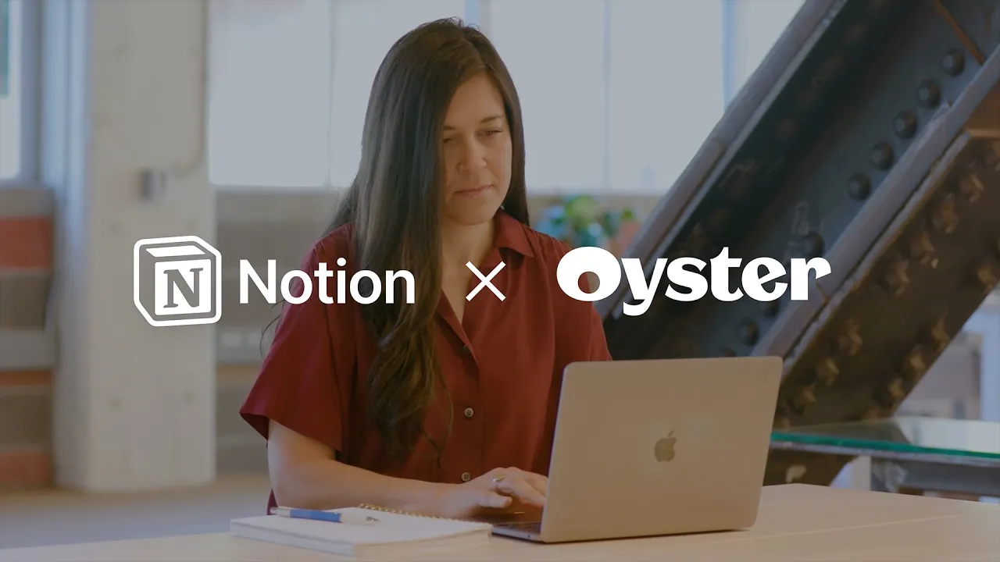

# Oyster x Notion: Connected through hyperscale with documentation

**URL:** [https://www.youtube.com/watch?v=DnVot24CRBg](https://www.youtube.com/watch?v=DnVot24CRBg)
**Date:** 2023-03-09

## Transcript

**[Voiceover]**

"I only like to put stickers of things that I actually use so I have notion on here and then oyster of course and that I'm out of office indefinitely [Music] oyster is a Global Employment platform we're very young startup but we're quite large so in the last year we've hired over 500 people welcome hang on wait more people"

"coming in sorry asynchronous working is one of our core values it's amazing to be able to wake up and work with co-workers all across the globe but making sure that we're all still going in the same direction can definitely be a challenge I was lucky to have a very well-built notion infrastructure whenever I came on board everybody uses"

"notion you get to have your own individual notion page for onboarding that is our source of Truth For What is the most up-to-date the most current I was able to hit the ground running which is necessary in a revenue role that's kind of like the foundation when you join the company to get you using it and seeing how"

"Central notion is to what we do notion is like oysters digital headquarter it's the brain of the company where all of our processes are documented did our timelines resources it helps me to know how to work with different teams and it makes me more efficient on my day-to-day once the sun sets in a place and you sign off"

"for the day everybody has access to what they need to pick up and carry the work forward it's so ingrained in our way of working anything you need to do your job gets in notion"

