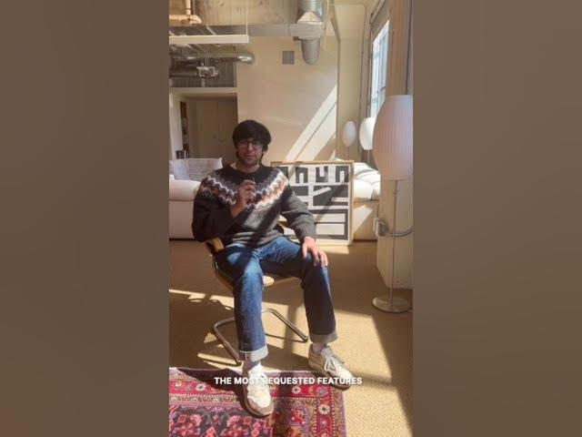

# Meet our engineering interns, Part 1!

**URL:** [https://www.youtube.com/watch?v=h0Vx_B8ZTOE](https://www.youtube.com/watch?v=h0Vx_B8ZTOE)
**Date:** 2023-04-03

## Transcript

**[Voiceover]**

"foreign I worked on team invite links to make it easier for people to join team spaces and to both invite people hey guys I'm Yash I was an engineering intern at notion and I had the chance to work on our weekly calendar view which is one of the most requested features from our community hi I'm Alice I got"

"to work with Integrations at notion if you are a developer you're now able to build an integration with both API and Link preview capabilities that allow data to flow in and out of notion hi I'm Elaine and I worked on quick capture on the notion IOS app hey everybody my name is Arturo and at notion I've been working"

"on a data migration framework to help make it easier to upgrade new versions of notion"

