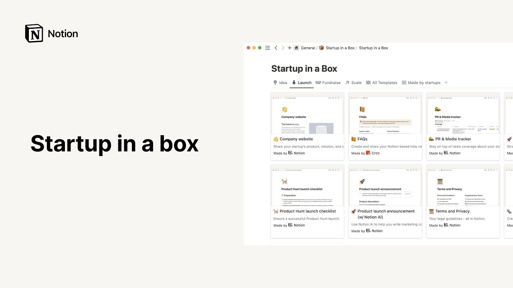

# Startup in a box

**URL:** [https://www.youtube.com/watch?v=4U3RnJRuyR8](https://www.youtube.com/watch?v=4U3RnJRuyR8)
**Date:** 2023-04-11

## Transcript

**[Voiceover]**

"life in a startup is hectic you're making decisions that will Define your company's future on a daily basis and figuring out how to grow your team secure investment and perfect your product as you go on top of all this you have to establish an operating system that can scale up with your organization notion boasts the power and flexibility"

"to support your growing team to this effect we've built a startup in a box template which you can access from our template Gallery at notion.com templates you'll find everything you need in this template from roadmaps and investor crms to company wikis and product launches all created by us at notion or by trusted startup partners and VCS you won't"

"have to painstakingly build an operating system from scratch now let's unpack the startup in a box and take a closer look at what's inside to get started pick your notion workspace into which you'd like to duplicate the template then hit duplicate template startup in a box will appear in your private section from here you can drag and drop"

"the page into the relevant place in your sidebar now let's open up the databases full page to better view its content the startup in a box Gallery contains many different templates you can use the database already has a few different tabs to view all templates click here each tab represents a different stage of a startup's journey from ideation"

"launch fundraising and scaling click on the tab or stage that's most relevant for you now let's open up a few templates to get a sense of what's inside launching a new product or feature is a pivotal moment for a startup and it's vital to get your launch copy on point but you don't have to spend hours writing your"

"announcement or hire copywriters you can spin up your product launch copy in just a few minutes using this template and notion AI you'll see there's some placeholder product description copy you can replace these bullet points with copy about your own product launch for demonstration purposes we'll leave this text as is next head to the AI block at the"

"top of the page adjust the prompt to suit your product and desired target audience when you're happy hit generate Notions powerful built-in AI will now draft your product launch announcement you can either edit the resulting text yourself or keep asking follow-up prompts for notion AI to refine its results according to your instructions to learn more about notion AI"

"watch this video in the ever-changing world of a startup you need people who can bring your vision to life when it's time to grow your team you don't have to waste time setting up a whole new job site you can let notion do the work for you when you open up the careers page template the first thing you"

"can do is replace the placeholder text with your own company bio underneath this you'll find a hiring database for all your open roles you'll see some examples here a full stack engineer and a senior front-end engineer for the engineering team and a product designer for the design team to make it easier to navigate create custom views to filter"

"your jobs board by team this will be helpful if you have a lot of open roles at once take some inspiration from these examples and customize them according to your company's open roles at the bottom of the page you can add some more information about life at your company include some images and talk about your mission vision and"

"values when you're done with your careers page go to the share menu at the top right of the page toggle on share to the web and just like that your careers page is now published to the web it's a fully navigable searchable web page that will automatically update anytime you make changes whether you're looking to secure your next"

"round or just want to maintain healthy relationships with your investors your investor CRM is the place to track your funding and manage investor relationships at the top of the page we've included a breakdown of all the properties in the database such as the status of investment process pitched one loss Etc Capital committed your warm contact and more to"

"add another property just go to the options menu in the database click properties and new property this database will show you the total invested in your company to date and help you unlock your next financial milestone now let's go back to our main startup in a box page using the breadcrumbs at the top left of the app underneath"

"the database there are some additional resources like notion Academy which can help you get to grips with notion and learn everything it is capable of you can get more information about our special perks for startups or also apply to join Notions Champions community and book office hours with the notion team for customized help on your workspace startup in"

"a box is a One-Stop shop to get your startup up and running and establish the documentation and operating systems that will support you through all stages of your company's growth it will help you quickly set up a notion workspace tailored to your every need as peculiar as those can be during the beginning stages of a startup [Music]"

