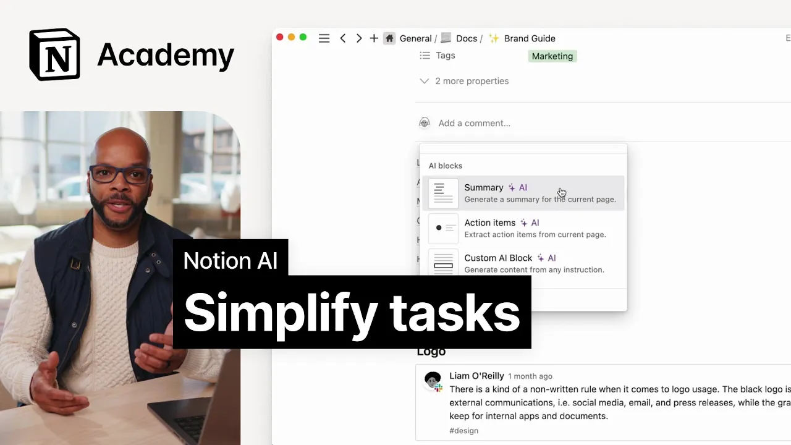

# How to use Notion AI to work faster

**URL:** [https://www.youtube.com/watch?v=ZdNdE7oAk1k](https://www.youtube.com/watch?v=ZdNdE7oAk1k)
**Date:** 2023-04-19

## Transcript

**[Voiceover]**

"[Music] foreign we'll learn how to use AI to extract information from text by summarizing and pulling action items from a meeting transcript your notion workspace probably holds so much more than just content drafts it's also your home for strategy docs research project plans and meeting notes notion AI can pull context from these pages to generate more informed outputs"

"than is possible with other AI tools this means you can offload time-consuming tasks that notion AI can do in seconds like summarizing notes distilling research and translating documents three key actions power this type of word first summarizing you can highlight any text in ask notion AI to summarize it this is great for internal docs web articles and so"

"much more you can also extract insights notion AI can quickly analyze text-based data and identify common themes or patterns allowing you to glean learnings from the data more efficiently finally you can generate texts with page context you may not realize it but many of the examples in this course were polished into coherent sentences based on just a few"

"Scrappy notes thanks to notion AI to access these features you can highlight a text selection or go to a new line and press space for AI what's more you can use AI blocks these are special notion blocks that you can add by typing forward slash AI a summary block will allow you to generate a summary in a single"

"click action items will extract documented next steps while a custom block lets you write any prompt to generate outputs with ease these are especially cool to include in templates for meeting notes or docs which we'll explore later in this video before getting into that let's consider just a few practical applications of how these actions make your work more"

"efficient summarize a lengthy process document summarizing lengthy process documents can save a lot of time while still retaining the most important information you might include overview sections at the top of every dock that are written by notion AI to help give readers context on that Page's content summarize research from the web including with Notions Web Clipper if you're"

"clipping articles into notion with our Web Clipper try summarizing them before digging too deep this can also be useful for people who need to read through many research papers or articles quickly extract themes from survey data if you have a notion page containing customer feedback or survey responses try asking AI to summarize the main themes or Trends to"

"follow up on crafter performance review from a few bullet points start by writing out a few messy bullets then ask AI to turn your unstructured thoughts into a coherent well-written performance review these are just a few of the many actions you can take with notion AI to speed up your work but before moving on to generative AI let's"

"see how this can work in a true everyday setting meetings incorporating AI into your meeting note-taking process can be a game changer as it allows you to save time and focus on the most important aspects of the meeting instead of spending hours sifting through pages of meeting notes to find the key takeaways or action items you can use"

"AI to automatically generate summaries of the meeting or highlight the most important points let's consider what that might look like at Acme Inc here we'll want to create a database template in your meeting notes database that uses AI blocks to remind participants to use AI to speed up tasks this could include prompts to use AI to summarize or"

"extract insights from the meeting or to translate notes into different languages if you have an existing meeting notes database you can create a template by navigating to the arrow next to the blue new button on the right hand side of the database let's consider the example of a sales Discovery call template used to document a leads interest in"

"Acme software here we might have an agenda for the call questions for the SDR to ask as well as a top level section for summaries and action items that other members of the sales team can look at to get a quick picture of what's going on with the customer let's add a summary and action item AI block here"

"just type forward slash Ai and scroll down to select the block you want to add let's first add a summary block and then action items now when we use this template it includes all the AI blocks you need to work efficiently what's really cool here is that if your team uses a tool to record and generate transcripts of"

"meetings this effectively means you don't have to take notes at all simply paste in the notes click your two buttons and you're done next time you take meeting notes take a minute to use the forward slash summarize command and see how it works by the way scripts for videos like this one usually take our content team several hours"

"to write the script for this video started as a list of topics and examples to cover and notion AI helped us turn those ideas into the script you just heard all in a fraction of the time it usually takes [Music]"

