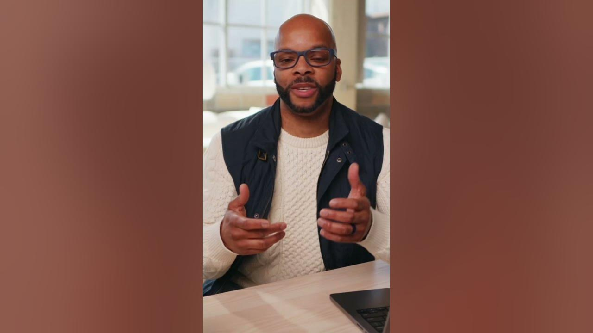

# Social media captions with Notion AI + tips on how to write a good prompt!

**URL:** [https://www.youtube.com/watch?v=qFeey_FuOkk](https://www.youtube.com/watch?v=qFeey_FuOkk)
**Date:** 2023-05-15

## Transcript

**[Voiceover]**

"we'll learn how to generate text from scratch with AI by writing great prompts and follow-up prompts all prompts can be broken down into a few Key Parts the medium of content like a blog post social media post Etc the topic of the content I.E a post about blank the format of the expected output this one is really key"

"so let's dive in AI can generate catchy and engaging captions for social media posts we'd want to tell AI the desired length of caption and any other inclusions you'd want in the output like hashtags and emojis where relevant you can even specify which platform the caption will be used on to better match tone we like to say you"

"can keep the best and delete the rest happy drafting"

