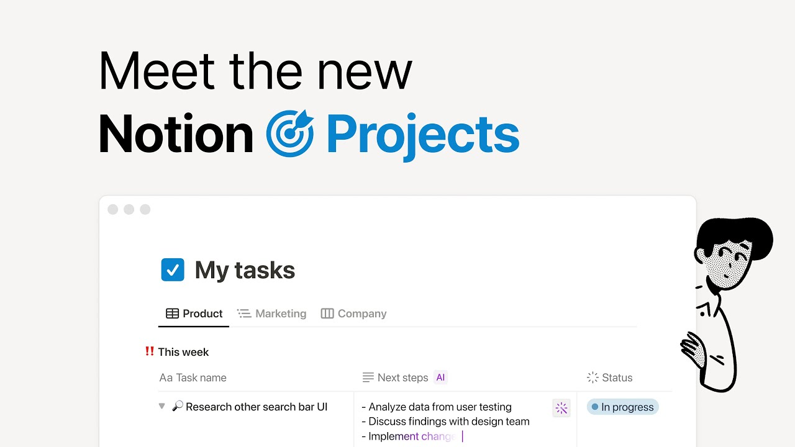

# What is Notion Projects?

**URL:** [https://www.youtube.com/watch?v=FPqCT0RiybQ](https://www.youtube.com/watch?v=FPqCT0RiybQ)
**Date:** 2023-05-31

## Transcript

**[Voiceover]**

"You bought a tool to manage projects and stay on track. So, why do you need to buy even more tools to get the job done? Tasks here, specs there, meeting notes everywhere. There's a better way to work, and it's called Notion. Notion combines project management with your docs, knowledge base, and AI, so you can stop jumping between tools"

"and stop paying too much for them too. In one workspace, track your tasks, then let AI find the next steps. Manage your team's projects and roll everything up to the big picture. Build roadmaps across teams, then figure out how to build the thing, right inside. Sprint together, and run your standup meetings in the same place. To get started,"

"just check a few boxes and watch your system set itself up. That's project management with Notion. Less tools, less chaos, so all that's left to do is ship."

