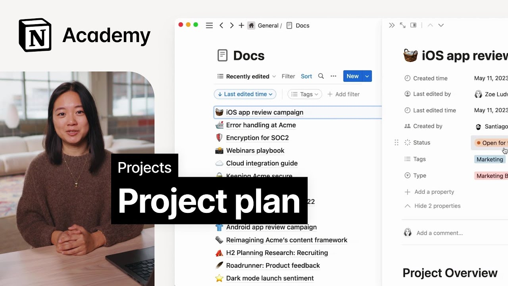

# Create a project plan

**URL:** [https://www.youtube.com/watch?v=1bQFXC_isKU](https://www.youtube.com/watch?v=1bQFXC_isKU)
**Date:** 2023-05-31

## Transcript

**[Voiceover]**

"foreign we'll focus on creating a project plan in notion while we'll spend most of this course in our task management system getting alignment from your team is an important first step in planning a project and it usually happens in the form of a proposal dock whether it's a PRD a text back or anything else The Proposal is key"

"to making sure all stakeholders are bought in and ready to accomplish something great once this dock is created you'll be able to link to Key Parts in the form of synced blocks and relations in the project tracker that will fill out throughout this course we recommend teams make use of one centralized docs database for managing all of these"

"Moment In Time Pages your team might create with that let's jump into an example in this course we'll work through planning a project from start to finish and invite you to follow along as you plan one of your own I'll be using the example of a website redesign project in our Acme Inc workspace here we'll navigate to docs"

"and create a new page then we can use the product spec template to generate an outline for the proposal quickly give it a name and we're ready to start entering information this template includes key sections problem proposal and plan plus questions to consider as you embark on your project for now I'll leave answers in the form of a"

"few bullet points our problems might include lack of brand identity opportunity for improved conversion and bad layouts on mobile that's it for now as you move into this course start thinking about an upcoming project that you'd like to tackle in your work or personal life in the next lesson we'll use AI to make our project plans better and"

"we'll invite you to write your own project plan alongside Us by the way check out notion 101 if you want to learn more about how to use databases and database templates to create custom docs databases for your team [Music]"

