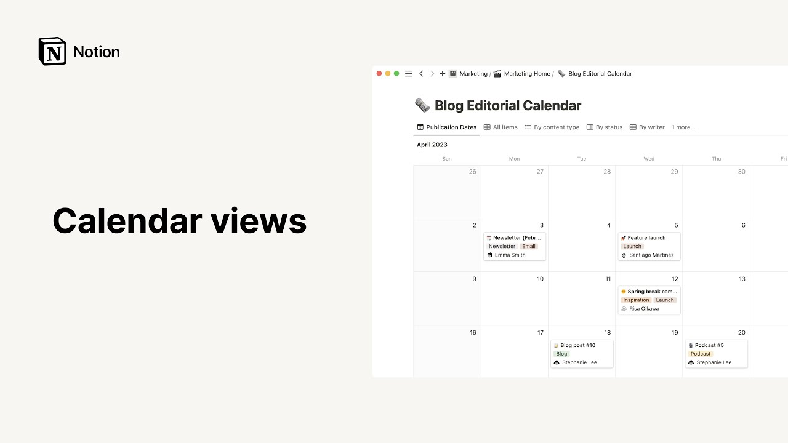

# Calendar views

**URL:** [https://www.youtube.com/watch?v=PoYepEsN0HY](https://www.youtube.com/watch?v=PoYepEsN0HY)
**Date:** 2023-06-05

## Transcript

**[Voiceover]**

"hello this video will teach you the many ways you can use calendars in notion to keep track of events deadlines schedules and More in notion calendars are databases that allow you to organize information by date we'll show you what we mean adding a calendar to your workspace is no different to adding any other kind of database you'll only"

"need to click on the new page button give your future database a name and specify in this drop down the teamspacer page where you'd like your calendar to live then choose calendar from the database section you can use entries from an existing database in your workspace or select new database to start from scratch should you choose the latter"

"a new page containing your brand new calendar will turn up to achieve the same thing you could place your cursor inside an already existing page and type the forward slash key followed by the word calendar then either click on calendar view or press enter this action will embed your calendar directly on the page we call this an inline"

"database to have your database take up a full page of its own you'll need to click on your calendar six dot icon to the left then select turn into page now the notion template picker already boasts a Blog editorial calendar so let's use it to get a head start click on get template to add it to the workspace"

"and specify the team space where you wanted to live to move your template to a preferred page in your team space simply drag and drop it in the sidebar like so now there is an already existing calendar view in this database to make it your main view click on its name and drag it to the far left great"

"our blog editorial calendar is now ready to use with every database entry being a publication here you can handily view your planned content pieces over time but also use the pages within your database to store every step of editorial production from initial brainstorms to the final text to add an item to a calendar hover over the day you"

"want to add it to and click the plus sign this will conjure up a brand new database page give your new publication a name and now you can use the body of the page to collect all your research interview recordings or even full drafts of what you want to write all things you can store in a regular notion"

"page remember that what differentiates a notion database page from regular notion pages is the property section at the top Properties or pieces of information about each database entry those can come in many shapes or forms such as text numbers single select menus multi-select menus dates people and more since calendar databases display entries according to their date such databases"

"must at least have one date property as with all other database types you can modify delete or add as many properties as you like here in the case of this template folks can specify the content pieces status or audience type they can check a box once visuals are ready as well as signal the article's writer reviewer and content"

"type finally the final URL can be neatly pasted here click on add a property to do what the button says here we'll add another date property which will deem deadline and click inside the box next to it to communicate the date when the piece should be ready as a reminder any changes you decide to make to your database"

"or database view can be done from the main menu symbolized by this three dot icon to the right as the layout section indicates this is indeed a calendar database when your calendar boasts more than one date property which is currently your case you will be given the option to organize your entries according to any of those dates here"

"we can decide whether to display entries according to their publish date or their deadline if both of these views interest you simply pick one here and add another calendar view to your database which features the other option like so to distinguish them from each other we'll name our new calendar view deadlines and our original calendar view publication dates"

"let's go back to the layout section of the menu here you'll notice that you can choose a monthly or weekly calendar view for your database what's more you can decide how you want your database pages to open up when you click on them sidepeak opens pages on the right side leaving part of the database visible to the left"

"similarly centerpiece keeps the database as a background but this time opens pages in the center and as this message points out is the default setting for calendars finally full page automatically opens the entries as full pages click on the left Arrow next to layout to go back to the main menu if you are indeed acquainted with databases this"

"menu should be a familiar site for you by now especially because the remaining sections stay the same for all database types let's go through them quickly click here to show or hide the properties you want on your database cards as well as edit delete or add properties the filter section is where you can apply filters to your database"

"View for instance you could ask to only display articles written by Stephanie Lee note that sorting entries isn't necessary for date properties in the case of a calendar view where entries are already displayed chronologically the database menu is a place to go should you want to lock your database to prevent accidental changes from team members you can also"

"copy the link to this particular view duplicate the view or delete The View that's all for calendars remember that those are just one of multiple kinds of database views you can create with notion as this template shows you can also view the same data and custom built table views lists boards Etc and switch seamlessly between them by clicking"

"on their tabs to learn more about other types of database views you can watch our tables boards timelines and lists video we hope this helps you and your team's day on schedule [Music]"

