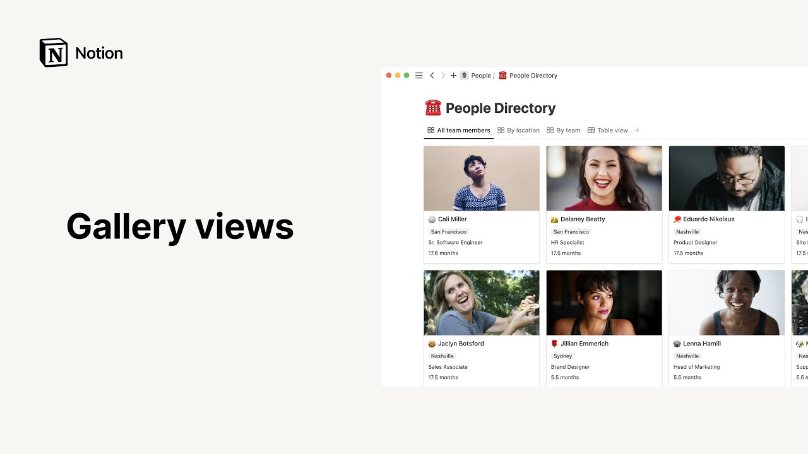

# Gallery views

**URL:** [https://www.youtube.com/watch?v=RNkpc84wYn8](https://www.youtube.com/watch?v=RNkpc84wYn8)
**Date:** 2023-06-05

## Transcript

**[Voiceover]**

"did you know you could use a notion database to beautifully showcase photos and text in a gallery this video will show you how to add a gallery to your workspace and customize it according to your needs galleries make visual information more digestible and simply good looking there are a couple of ways to add a gallery or any other"

"database type for that matter to your workspace one is to click on the new page button choose the team spacer page where you'd like to add your gallery give your gallery a name then hit more in the add new section and pick gallery another is to place your cursor on a new line then hit the forward slash key"

"followed by the word Gallery then either click on gallery view or press enter this section will embed your calendar directly on the page we call this an inline database to view your database as a sub page you'll need to click on your gallery 6. icon to the left then select turn into page in both cases you can either"

"use entries from an existing database in your workspace by selecting a data source from the list here or select new database to start from scratch and name your new Gallery at the top of the page here we could start building our new people directory from scratch or add the already existing template of the same name to speed things"

"up to add a template to your workspace click on templates from the sidebar scroll down to preview templates or use the search bar to find the one you're looking for when you're ready click on get template and add it to your desired team space like so to move your template into a top level page in your team space"

"simply drag and drop it this way lovely this Gallery is a team directory showing photos of every team member first notice that each card has its own page which you can use to add all the content you want in the context of this people directory this might be a photo of the team member a short bio as well"

"as their past achievements and goals as you can see this photo is the same that is featured on the cover of the card in the gallery we'll show you how to achieve this later to add a new item simply click on new at the bottom of the gallery or click on the blue new button which could be found"

"at the top right of all databases in this case we'll enter our new team member's name here and use it as the page title unlike regular notion Pages database Pages boast a property section at the top this section is highly customizable and that you can modify add or delete as many properties as you want from here to fit"

"your needs in this case folks can specify the office where a team member is based as well as their Department they can also type in their job title here click on the date they joined the company paste in the link to their LinkedIn profile as well as their email and phone number or type in their favorite dessert in"

"the empty box next to it what's more this Advanced Property automatically calculates the amount of time the person has been at the company using an already built mathematical formula remember any changes you make to the property section will affect the entire database something to keep in mind especially when deleting properties let's click outside the page to go back"

"to the gallery view now let's have a look at our gallery's main menu which can be accessed by clicking on this three dot icon to the right the layout section will specify that this is indeed a gallery database to choose what you want your gallery to display click on cart preview you'll find different options page content will grab"

"the first image displayed inside the page and use it as the card cover if there is no image on a page the car cover will show a peak of the card's other content like text or to-do list page cover will grab the cover image of the page and use it as the card cover finally the none option allows"

"you to get rid of card covers altogether the next option for formatting your gallery is card size this one is pretty self-explanatory you can choose to have small medium or large cards the default image ratio is 69 but if you want your images to appear in their original ratio just toggle on fit image this will create Blank Space"

"around the image plus you can decide how you want your database pages to open up when you click on them sidepeak opens pages on the right side leaving part of the database visible to the left similarly centerpiece keeps the database as a background but this time opens pages in the center and as this message points out is the"

"default setting for galleries finally full page automatically opens the entries as full pages the remaining sections stay the same for all database types let's go through them quickly click here to show or hide the properties you want on your database cards as well as edit delete or add properties the filter section is where you can apply filters to"

"your database view for instance you could choose to only display members from the engineering department click on sort to sort your entries according to certain properties here for example names are already sorted in alphabetical order this option allows you to group team members by one of their properties as an example this view already groups people by their location"

"while this one groups them by their Department note that notion makes it easy to view the same database several different ways and switch between them anytime by clicking on these tabs finally click here to lock your database and prevent accidental changes by team members you can also copy the link to this particular view duplicate the view or delete"

"The View that's all for galleries with this information in hand we're excited to hear about the neat setups you'll come up with for your own people directories design portfolios mood boards and more [Music]"

