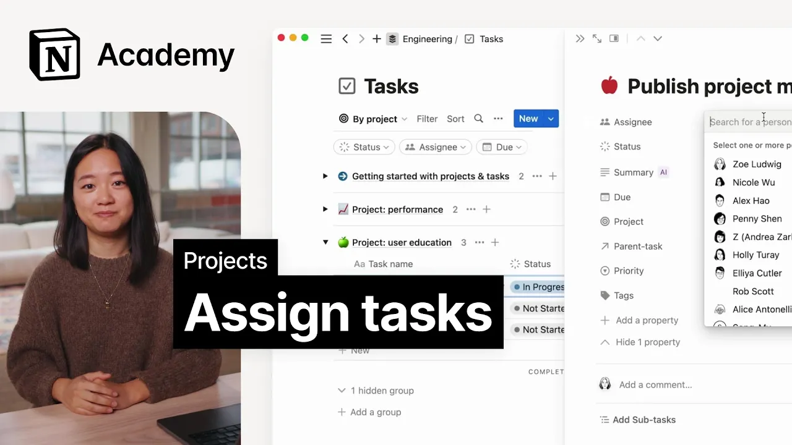

# Assigning tasks to others

**URL:** [https://www.youtube.com/watch?v=6MUhPzcDpDc](https://www.youtube.com/watch?v=6MUhPzcDpDc)
**Date:** 2023-06-05

## Transcript

**[Voiceover]**

"foreign we'll assign tasks to team members and fill out task information just like projects we can open any task as its own page and give it its own set of associated information this information which we call properties includes things like task owners status and due date when you have hundreds of tasks properties are essential to help you sort"

"filter group and prioritize your work this is mostly done through custom views which we'll get into later but as a quick example consider this my tasks view which filters tasks by assignee to parse out tasks that are assigned to the person viewing the board you could further group it by priority and status to help that person decide what"

"to focus on in any given day you can also add custom properties like connections to docs or meeting nodes to associate otherwise disparate Pages quick note to assign a task to someone they have to have page access you can check who has access to a page with the share menu in the top right hand corner once assigned teammates"

"will get a notification about the task if you want to learn more about sharing permissions and team spaces in notion we recommend checking out our scaling your team course let's go ahead and open the task we created in the last lesson create research questions just like in our projects page there's a top level section prompting you to input"

"key details for starters let's assign this task to a team member by clicking on the drop down menu and selecting their name or you could simply start typing for the same results we can follow a similar flow to add other key details like task status due date priority and tags these parent tasks and project Fields help to associate"

"a task with other pages in your workspace as you can see the project is already filled out since we created tasks directly on the project page parent and subtasks help to enable those toggles we looked at in the last lesson that's all you really need to get started in later lessons we'll learn how to add custom properties including"

"a special AI property before moving on try assigning tasks to your teammates if you need help adding users to your workspace check out notion 101 foreign"

