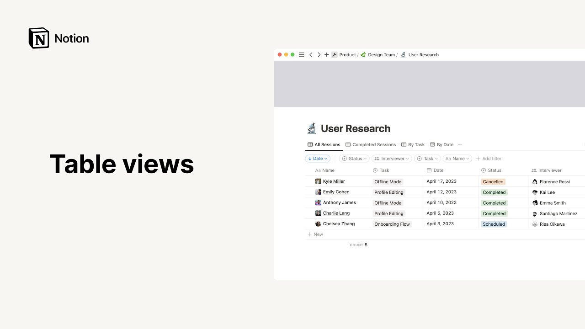

# Table views

**URL:** [https://www.youtube.com/watch?v=-izAC1eour4](https://www.youtube.com/watch?v=-izAC1eour4)
**Date:** 2023-06-09

## Transcript

**[Voiceover]**

"hello this video will show you how to use and get the most out of table views tables provide an efficient format to store and organize information as well as filter sort or group it according to your needs to add a table to your workspace you can click on the new page button situated towards the top of your sidebar"

"click on add to to determine in which team space or page you'd like to add your table and select table from the add new section you'll then be prompted to select an already existing data source in your workspace or create a brand new one from scratch to do the latter click on new database another way to achieve the"

"same thing is by placing your cursor on a new line then hitting the forward slash key followed by the word table then select table view from the drop down the same options will show up but this time the table will be embedded directly on the page we call this an inline database should you prefer to view your database"

"as a sub page click on its six dot icon situated to the left and select the turn into page option click on your newly created page and the same empty table database will show up for demonstration purposes instead of creating a new table from scratch let's add one from the template picker which can be filed towards the bottom"

"of the sidebar click on templates and scroll down the sidebar to see what's available or use the search bar at the top left to find already built tables you'd like to use in this case we're going to add this user research database and add it to the product team space to move your new template inside a top level"

"page in your team space simply drag and drop like so this is what a table view could look like in this case this database boasts four different views and you can easily switch between them by clicking on their tabs in the case of table views entries are displayed in the First Column to the left as with all other"

"notion databases every entry is in fact a page in itself which you can use to store all the information you want in the case of this user research database every entry serves as a user interview in other words the title's entry is the name of the person your research team interviewed contrary to regular notion Pages database Pages include"

"this property section at the top to add a property click on the button of the same name scroll down and select the property from the list or look it up in the search bar name your new property and click outside the pop-up great now let's click outside the database page to go back to our database View to add"

"a new entry in a table view click on the new button located at the bottom of the First Column or click the blue new button at the top right of the database let's add a few more entries to our database as a reminder any database or database views main menu is accessed via this three dot icon to the"

"top right let's go to the layout section as you can see this is indeed a table view for tables you can toggle this button on to show vertical lines or toggle it off to hide them you also have the option to wrap all columns within your table that is if your cell contains a lot of content you can"

"have it appear on multiple Lines by turning this toggle on lastly this option allows you to pick the way you want your database pages to appear when you click on them your three options are side Peak which opens pages on the right side and is the default option for tables Center Peak which opens pages in the center of"

"the app our full page where the database entry takes up the entire page instead of having the database visible in the background let's go back to our table's main menu remember that you can go to the property section to show or hide the properties you want an open eye next to a property means that the property is visible"

"whereas a closed I means it's hidden you can also click on new property to add another property to the database and click on each property six dot menu to alter them at the granular level now this is where to go to filter your database entries that is show only selection of data based on specific filtering rules for example"

"this table view only shows tasks whose status is completed go here to sort your entries according to properties for instance you could choose to display your tasks in descending chronological order this here translates as date descending now this is a suggestion to group your entries according to one of their properties as an example this view groups entries by"

"task which separates all database entries into smaller groups one for each task now the sub items option enables you to add sub items to already existing database items items that are also pages in themselves to use this feature click here you'll be invited to rename the parent and sub item Fields as needed these will appear as properties in"

"your database now click create an arrow pointing to the right should now appear next to every table entry now let's click on the Arrow hit new sub item and name it like so followed by the enter key here are a few examples of sub items you can add to this user interview as you can see each sub item"

"is a page in itself boasting the same properties as parent items notice that the parent item property automatically links to the parent item it is related to equally you can see the sub items that are linked to a parent item here for this database the option of sub items is handy because many of these tasks require further actions"

"from different team members this makes it easier to set out and accomplish what needs to get done to hide sub items simply click on the downwards pointing Arrow next to the parent item let's go back to our Table menu click here to lock your database and prevent it from accidental changes by team members you can also copy the"

"link to this particular view duplicate the view or delete The View finally a great thing you can achieve with tables specifically is calculations hover over the bottom of any column and you'll find the calculate option click on it and a few choices will show up these depend on the type of information the column contains in this case folks"

"are interested in knowing the average amount of minutes it takes users to complete a task fittingly they selected average from the drop down and this number now appears at the bottom of the column that's all for this video as you can now appreciate notion tables are Dynamic databases that can be customized down to your every wish we hope"

"this video gave you the tools you need to create your own powerful tables one second then help you focus on doing what you do best and if questions still arise please visit our help center at notion.com help enjoy [Music]"

