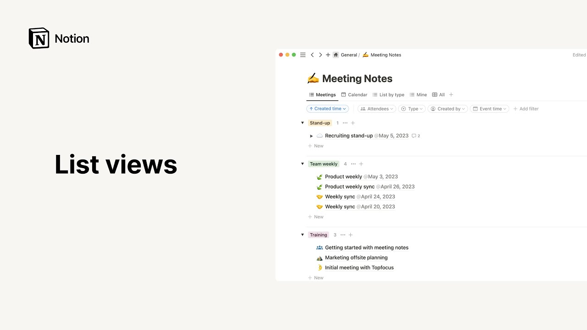

# List views

**URL:** [https://www.youtube.com/watch?v=Qhvix00IE0k](https://www.youtube.com/watch?v=Qhvix00IE0k)
**Date:** 2023-06-09

## Transcript

**[Voiceover]**

"hello there let's talk about list views in notion lists are a minimalist layout option ideal for creating a simple index of documents meeting notes journal entries or even todos we'll show you how to add one to your workspace as well as the features that make this neat view unique to add a list to your workspace click on the"

"new page button towards the top of the sidebar use this drop down at the top of the page to choose where to add your list in this case we'll pick the General team space then in the add new section select more and list now you'll be prompted to either select an already existing database to work with or create"

"a new one by clicking on new database let's opt for the lad there you have it a brand new list database that you can name at the top another way to achieve the same thing is by placing your cursor where you want your list to be then typing the fort slash key followed by the word list then press"

"enter let's click on new database again and your new list will show up notice that the list appears inside the page as opposed to being a page in itself this is what we call an inline database to turn this into a page click on the databases six. icon to the left and select turn into page leftly now instead"

"of creating a whole new database from scratch let's save time by adding an already built template Instead at the bottom of of the sidebar select templates to access the template picker then click on any template to preview it if you're looking for something specific you can use the search bar to find it once you find one that suits"

"your needs click on get template and pick the teamspace to store it in again let's add our template to the general teamspace here you go we can rename our template here and give it a new icon you can think of lists as a simplified version of tables with every database entry appearing from top to bottom click on new"

"to add a new entry and remember that such entries are in fact pages in themselves ones that you can use to store all the information you want this is particularly relevant to a meeting notes database where each database entry becomes the notepad in which to write what was discussed action items as well as who attended for demonstration purposes"

"let's modify these default entries and add new ones your meeting notes are ready to be consulted by team members who didn't attend the meeting or those who would like to be reminded of their content now let's go to our views menu symbolized by these three horizontal dots at the top right of the database in the layout section you'll"

"see that this is indeed a list layout here you can choose how you want your database pages to open up when you click on them you can have them appear on the right side of the app the default option for lists or in the Center full page automatically opens the entries as full Pages as a reminder you can"

"show or hide the database properties you want in this section and click on any property 6. icon to edit duplicate or delete it from your database you can also add a new property from here apply whatever filters or sorts you deem useful to your view here the group option is a prompt to divide your list into smaller groups"

"based on one of your properties for instance Group by type will automatically create sections in your list for each meeting type like so to hide a group from this view simply click on the open eye icon to its right and click next to a closed eye icon next to a group to show it what's more you can turn"

"this toggle on to do what it says hide empty groups from your view to hide the pages Within aou group but still show the group in your view click on this arrow pointing downwards to revert this action click on the Arrow again now this option enables you to add sub items to already existing database items items that are"

"also pages in themselves click here and you'll be invited to rename your parent and sub item Fields as needed these will then appear as properties in your database click create and an arrow pointing to the right should now appear next to every database entry click click on the Arrow to add a sub item then on new sub item"

"and give it a name here are a couple of examples of sub items what could add to this already existing meeting doc as you can see each sub item is a page in itself posting the same properties as its parent item in our case the parent item refers to the meeting note doc you can see the meeting the"

"sub item is related to here equally any parent item will have its sub items listed out here and instead of having to create a subpage inside your database page sub items allow you to add pages that will be visible from your list View and add new ones with the simple click of a mouse next notice that you have"

"the choice to set your load limit to 10 25 50 or 100 Pages at a time this is especially useful for lists with many rows whose data may be slower to load all at once and last but not least this option allows you to lock your database to prevent team members from for making accidental changes you can copy"

"the link to your view here as well as duplicate or delete your view voila to conclude notion lists are a simple way to create an index of documents and store all relevant information inside each you can see list entries as folders of knowledge ones that you can filter sort or group as you fancy and even create smaller folders"

"within them remember that you're free to add as many views of the same database as you like and easily switch Swit between them by clicking on their tabs with neat lists like this one your information is easily retrievable and digestible and nothing gets taken out of context to see what we mean go ahead and create your own minimalist"

"list View"

