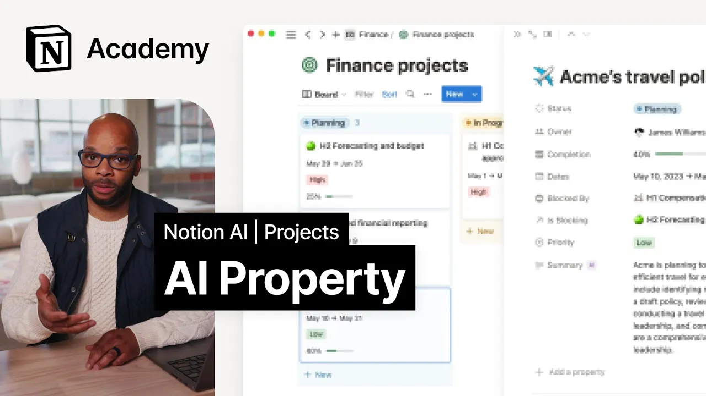

# AI Autofill property

**URL:** [https://www.youtube.com/watch?v=pLsk6edS8pw](https://www.youtube.com/watch?v=pLsk6edS8pw)
**Date:** 2023-06-12

## Transcript

**[Voiceover]**

"foreign is the first project management solution with AI fully accessible we've explored how to use AI to help with project plans and writing so in this lesson we'll explore how to make use of AI in your databases to enhance your project system as a whole if you ever find yourself looking at a huge collection of data like transcripts"

"from sales calls or messy notes from user research sessions and you're not sure where to start AI can help extract insights and summaries to get you going using AI AutoFill in a text property harnesses the power of AI plus the context of data on your page to automatically generate summaries extract key information or answer any custom prompt you"

"input these properties instantly update and add details to every role in a database but the uses for these properties with custom prompts are as boundless as your imagination here's just a few ways you might use custom AI autofills writing user stories try asking AI to generate a user story for a task this feature can be handy for product"

"managers who want to follow the user story format which is a way to describe a features functionality from the user's perspective listing risks or blockers to a task scan notes on a page to identify and list risks or blockers associated with the task this feature can be useful for tracking potential issues that may impede the completion of a"

"task in a less formal way than otherwise possible summarize the key results goals or metrics associated with a task by using these prompts users can get instant summaries and updates for every project and deliverable making the task or project database more efficient and effective back again on this projects board notice how every project has an AI generated summary"

"pretty neat huh let's also use AI to autofill a property that Aggregates all of the teams that are working on the project to do so we could ask AI which teams are working on this project display results as a list in a bullet point format to add our property we can open up any project page and click add"

"a property then Select Property type text now select custom add our prompt and voila we'll see that our page instantly updates with the list of teams mentioned in the project doc what's more we can return to our active projects View and see that each project has been updated with this information you can toggle these AI properties on and"

"off in any View using the view layout options in the three dot menu on the right that's it for now we hope this helps you to use AI to automate tedious information gathering processes and unlock much needed time to focus on impactful work foreign"

