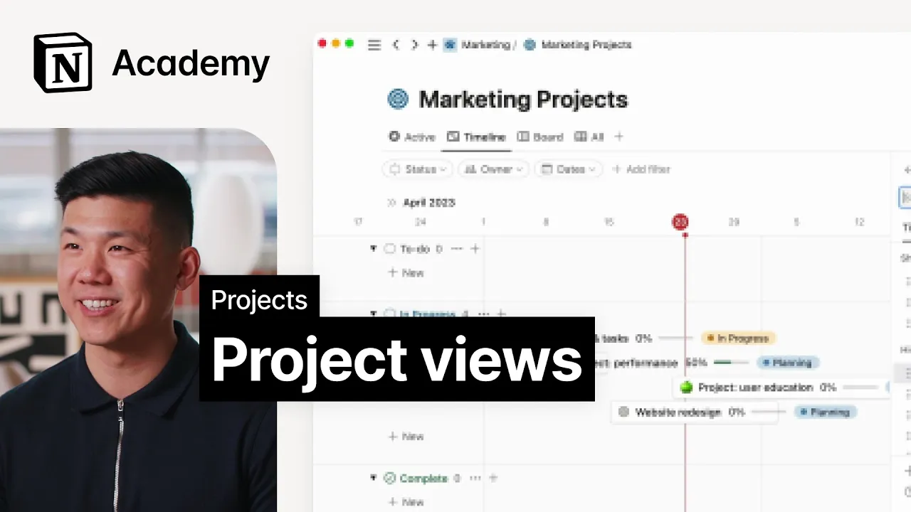

# Views for project management

**URL:** [https://www.youtube.com/watch?v=pw69U7byXU0](https://www.youtube.com/watch?v=pw69U7byXU0)
**Date:** 2023-06-12

## Transcript

**[Voiceover]**

"foreign and I work in customer success at notion together we'll talk through more ways to customize your project setup and incorporate additional teams in your workspace in this lesson we'll consider how to use the information we've curated thus far to view tasks in new ways unlike other project management tools notion doesn't force your team to work off the"

"same structure the projects and tasks databases come with a variety of views that are designed to help you work in a way that suits you best if you can't find the perfect view right out of the box don't worry anyone on your team can create their own custom views that are tailored to their unique workflow this level of"

"customization ensures that everyone can work in a way that is most productive for them so far we've spent most of our time in this view of tasks grouped by project this is a useful place to get a detailed picture of work that's going on across your team in your tasks board you'll find additional views by clicking the names"

"across the top of your table these all pull from the same underlying data so that you can visualize your project in a number of different ways in addition to the built-in views notion has layouts that are optimized for different productivity methodologies for example if you prefer a visual approach our kanban view in boards may be the perfect fit"

"alternatively if you need to plan out a project over a longer period of time our timeline layout can enable Gantt or critical path work quite well for teams that use agile methodology we recommend the Sprints board which we'll cover later on to customize an existing view click on the three dot menu in the top right hand corner here"

"you'll see a myriad of options including layout which Alters the way information is displayed filtering and sorting information and grouping like in the case of our default view which is grouped by projects to add a new view click the plus sign select new empty View and follow the same flow to customize now let's return to Acme to look"

"at just a few ways that different team members might use layouts to power their own personal workflows let's start with Liam an engineer who uses the my tasks view to get a snapshot of his daily and weekly tasks a project manager Amaya may spend more time on the Project's timeline view looking at status and owner properties this allows"

"her to keep track of the progress of different projects and also to know who is in charge of each of them as for Stephanie who is an engineering manager the timeline view with dependencies enabled is critical since it helps her understand the most important projects for her team to tackle in a given Sprint it also allows her to"

"identify potential bottlenecks and address them before they become major issues before moving on consider how you might manage personal tasks throughout the project you've been building and customize your views accordingly by the way if you're interested in learning more about how to create custom views be sure to check out these videos on databases [Music]"

