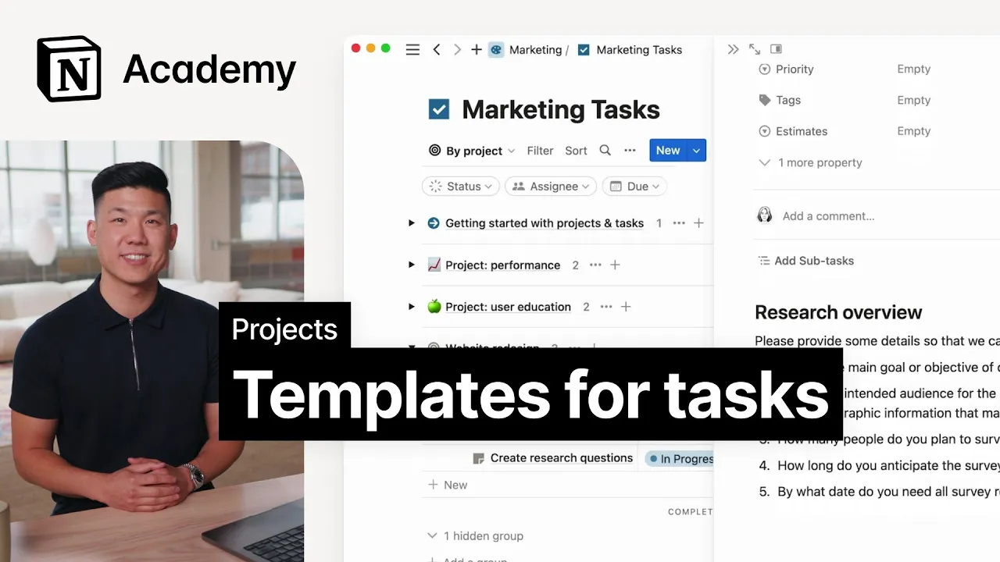

# Database templates for tasks

**URL:** [https://www.youtube.com/watch?v=aF4-9JyirDU](https://www.youtube.com/watch?v=aF4-9JyirDU)
**Date:** 2023-06-12

## Transcript

**[Voiceover]**

"foreign we'll use and create templates to fill out task details database templates can help speed up the process of filling out task details for your team or for teams who need to report issues to you examples of task templates that we commonly see in notion include bug reports you can streamline reporting by creating a template with key questions"

"to let teammates or the public add details about a bug they're experiencing in a way that's seamless for your engineering workflow request systems supporting teams who are regularly triaging requests May benefit from a request template in their tasks database asking for specific information about the requests that can't be captured in properties recurring process docs if you have tasks"

"that are repeated on a regular basis like creating a specific type of report or checking up on analytics drop down steps in a template what's more you can set it to be automatically created on your own timeline with the repeating database function as you can hopefully see using templates can help speed up processes streamline communication and ensure consistency"

"across different types of work and while we focus on tasks here these can be used for projects too you might create a template for a brand campaign product launch or any other number of repeatable work moments let's keep rolling with our website redesign project [Music] maybe our user research team has a templated process that they use for creating"

"a research survey every time a product team is requesting research we can add it into notion by using the drop down arrow to the right of the new button here we'll give the template a name and start to add headings and instructions for future users of the template to fill out just like that our task is pre-populated and"

"the requesting team can give our user research team all of the information that they need to get started this saves everyone time and ensures that all the necessary information is included as you're filling out task details for your project take a look at your list and see if there's a spot where creating a database template could help streamline"

"your process foreign"

