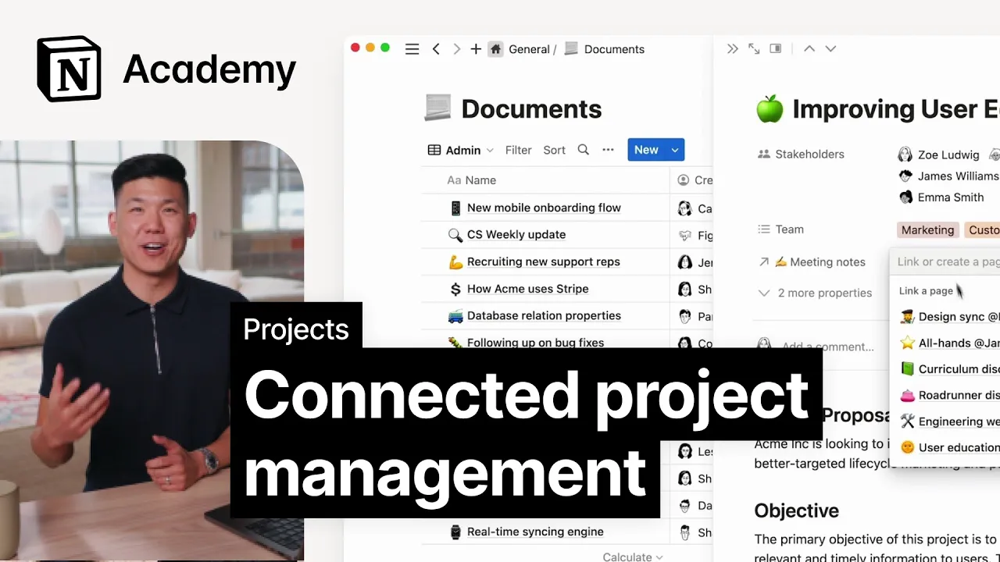

# Connect work with relations

**URL:** [https://www.youtube.com/watch?v=jAluo6XWV-0](https://www.youtube.com/watch?v=jAluo6XWV-0)
**Date:** 2023-06-12

## Transcript

**[Voiceover]**

"foreign you'll learn how to connect projects and tasks to other important notion databases like docs and meeting notes we say that two databases are related when an entry or multiple entries in one database relates to an entry in another for example you might have a document about an upcoming project and several meetings to discuss said document relations keep"

"these Pages linked together whether you've realized it or not projects and tasks are two separate but related databases in notion this concept can be further expanded to create a truly connected workspace if you're looking for meeting notes about a project don't try to remember the date of every meeting you've had instead use a relation property to aggregate them"

"right inside the project page itself we also have a concept of Roll-Ups and notion which allow you to view data from a related database that's how the task completion rate on your Project's database works it looks at all the tasks related to the projects checks their status and then rolls that data up into one nice number for ease"

"of use let's go ahead and add some relation properties to our projects and tasks databases in notion so that information flows better throughout our workspace foreign to add a new relation property go to the three dot database options menu then click properties and add a new property here we'll select the type relation at this point you'll be prompted"

"to choose which database you want to relate to projects in this case we'll pick documents since you likely have more than one document related to a project we won't limit this relation now we can go into our website redesign project and connect our project plan engineering Tech spec or any number of other documents that are important to this"

"project we could follow the same process to relate meeting notes to tasks adding a new property selecting the meeting notes database and relating meetings back on our projects board a roll up would allow us to see all meetings related to the project even though in this case projects and meeting notes aren't directly related all we need to do"

"is create a roll of property select the relation we want the rollup to be associated with and then pick which property to show on projects in this case meetings that's it for this lesson by using relations and rollups you can easily aggregate information and view it in a more meaningful way don't forget to check out our Templar gallery"

"to quickly add databases for your docs and meeting notes thanks for watching [Music]"

