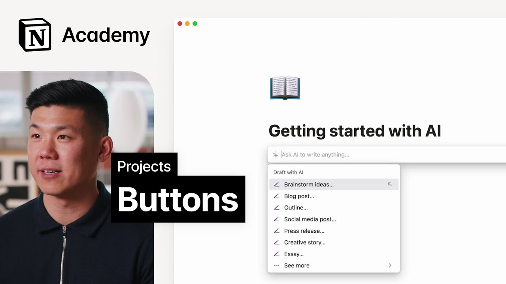

# Buttons

**URL:** [https://www.youtube.com/watch?v=MWOa6d_Hfcs](https://www.youtube.com/watch?v=MWOa6d_Hfcs)
**Date:** 2023-06-15

## Transcript

**[Voiceover]**

"foreign we'll create buttons that can be used to submit requests and reports to teams using the projects and tasks setup a great project management system is only as useful as it is up to date with tasks needing to be done of course you can add tasks yourself and ask colleagues to do the same but you'll probably be getting"

"tons of requests from other teams too who may or may not understand your notion setup buttons let you automate steps of creating a task or project and Abstract those Steps From the user who is requesting the project for that reason they're great for letting other teams create tasks in your database without exposing the whole system to them in"

"a way that might be confusing or lead to errors a few different ways your team can use buttons are report a bug to engineering team your go to market team can flag bugs or issues for engineering to look into without going to the bug tracker database submit a design request if your content team needs a new graphic for"

"a blog post they can send a request straight to the design team's project database even request multiple items with one button you can make a button to request multiple actions once a project is launched for example by clicking the launch button you could add a post to a social media calendar send a Content request to the content calendar"

"and change the project status to in progress buttons have five core functions that power these actions they can insert any block above or below the button any content blocks like check boxes bullets toggles Etc that you can use on a page you can include in this text box add a page row to a selected database with any selected"

"properties edit pages in a selected database you can choose to edit all pages or certain pages based on a filter show a confirmation menu to users before they run the action and open pages this could be an existing page or page that was created within the button itself any of these actions can be chained together too to see"

"how that works let's add a button to our Acme workspace [Music] perhaps during the building phase of our website redesign project we want to create an easy to use system for teammates to file bugs with the engineering team to do so we might employ a button that lets team members report a bug to an engineering team to do"

"this we'll head to a new page and type forward slash button from here we'll need to configure the button steps when this button is clicked we'll want to add a page to our task database edit properties and then open the page inside Peak View to accomplish this we can click plus add a step select add page 2 and"

"then pick the tasks database we've been working in here we can give the new page a name like new bug report and then give it specific properties like reporter as person who clicked this button and status of backlog lesson complete here we learn how to create buttons for submitting requests and Bug reports configure button steps and a use"

"case for creating an easy way for teammates to file bugs with the engineering team amazing work foreign"

