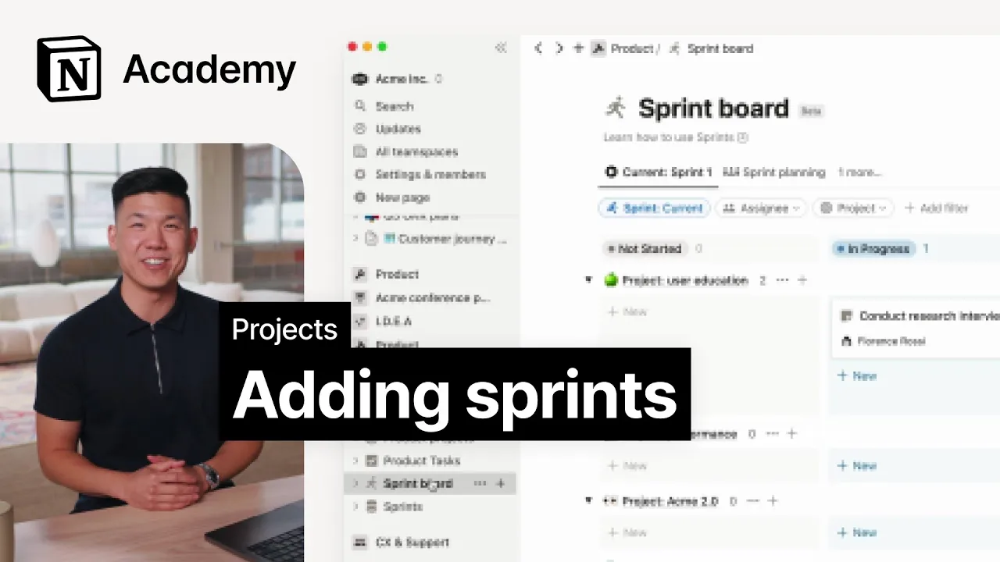

# Manage tasks in sprints

**URL:** [https://www.youtube.com/watch?v=EGtiYmvpUP8](https://www.youtube.com/watch?v=EGtiYmvpUP8)
**Date:** 2023-06-20

## Transcript

**[Voiceover]**

"foreign we'll consider how teams can manage Sprints in notion by taking advantage of the Project's tasks and Sprints template if your team Works in Sprints or chunks tasks into specific weeks notion Sprint automation may help you manage work more clearly Sprints like projects exist as a database which is related to a tasks database when you toggle on the"

"Sprint's property and tasks a new database called Sprints is created and notion creates a relation between this new Sprints database and your existing tasks database you'll also see a Sprint board show up in your sidebar then within any task you can navigate to the Sprint's property assign it to a Sprint and you'll see that task populate the corresponding"

"Sprint in your Sprints board once you connect individual tasks to respective Sprints you'll be able to use the view in the Sprints board to get an accurate picture of your team's work you can also start your system with Sprints enabled by duplicating the projects tasks and Sprints template into your workspace directly regardless your new Sprint board is the"

"place to go to manage Sprints here you'll see tasks grouped by project and Sprint with a number of other views to help your team manage their backlog on each Sprint's page there's a space for your team to plan team availability last Sprint review Sprint goals and so much more you may even want to use this page as a"

"running log for meetings and decisions made during the Sprint for the next few lessons we're going to switch gears in our Acme workspace to our engineering team's point of view we'll follow the same process as before to add the projects tasks and Sprints setup to our workspace only this time we'll add it to the engineering team space to"

"populate this I'll actually return to my marketing tasks board and reassign tasks to engineering by using the move to menu simply navigate to the three dot menu in the top right of any task then select move to and find the engineering tasks in the drop down or do this for multiple tasks at once with the bulk edits menu"

"back in our engineering tasks board we can use the bulk edits menu to assign these tasks to our current Sprint and voila in our Sprints board we now have a single page to manage an entire Sprint's worth of work with all the power of custom views and properties that you're used to a notion we hope you found this"

"introduction to Sprint to notion helpful in the next lesson we'll continue exploring how engineering teams can use notion to manage their work so stay tuned [Music]"

