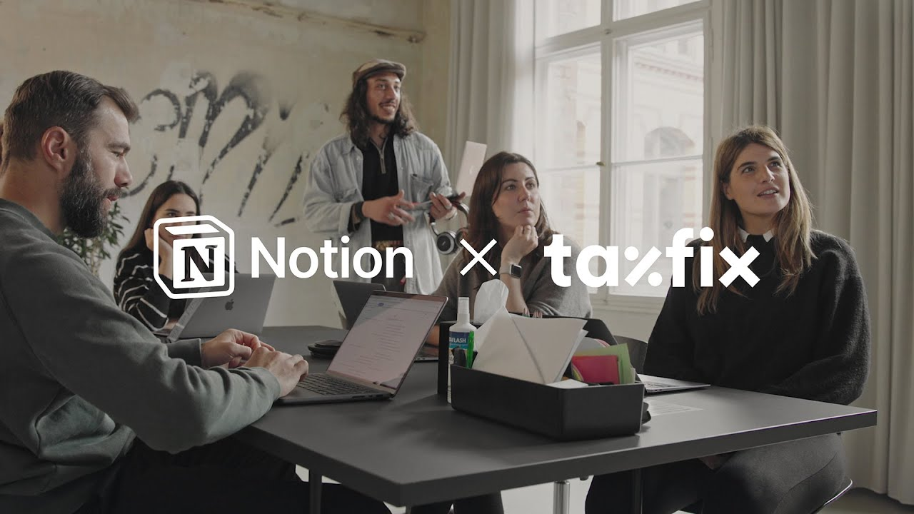

# How Taxfix makes projects transparent and scalable in Notion

**URL:** [https://www.youtube.com/watch?v=NK8icx1QALQ](https://www.youtube.com/watch?v=NK8icx1QALQ)
**Date:** 2023-06-27

## Transcript

**[Voiceover]**

"foreign [Music] help us to scale through running from a few projects to hundreds of projects and will support us with scaling to thousands of projects [Music] tax fix is Europe's leading mobile tax declaration app as a company we're all in notion with the growth tax fix has seen in the last years there is a high pressure on delivery"

"of the Best in Class software to our customers we used to work with a lot of different tools where stakeholders would have to look in multiple places to get a status update which typically led to a lot more confusion a lot more meetings a lot more one-on-ones and when it comes to building processes especially ones that are very"

"complex there needs to be a lot of collaboration you really start to find that as you don't have one Central Tool it can get very murky very quickly with notion we are able to bring visibility and transparency on what we are working on what our teams are delivering I'm working closely with engineering managers product managers product designers and"

"analysts streamlining the process so that they can work together with notion we created a single source of Truth we call it the portfolio database where we keep all projects the whole company knows that it can open each of the projects look for the updates depending on their requirements having one database for projects connected to strategy goals helps us"

"easily to prioritize initiatives based on the strategy goals and their priorities our team we do everything in notion and this allows them to focus more on the things that allow us to bring out new features allow us to be able to build a better product so this is something that we can see not only affects us but also"

"brings value to the entire organization which in turn brings value to our customers the biggest value I see in Ocean brings to our company is actually time saving we don't need to replicate the data that we already entered once we don't need to use all the tools to represent this data we can standardize everything so the whole company"

"speaks the same language there have been plenty of instances where people have come to us asking to implement a tool because it does something specifically and we can turn around and say hey notion does this this is super super beneficial not only from a Time perspective but also from a money perspective notion is the core place where everyone"

"goes when they start their work this is our knowledge management system our task tracking system our second brain our source of Truth when we come to the office first things I open is an ocean"

