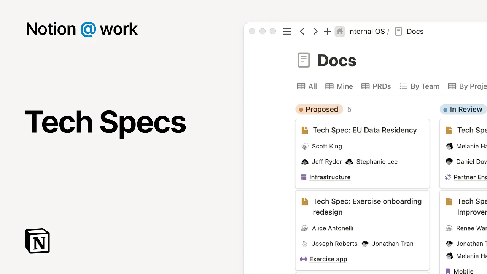

# Notion at work: Tech specs

**URL:** [https://www.youtube.com/watch?v=YSFdy-ZuFHk](https://www.youtube.com/watch?v=YSFdy-ZuFHk)
**Date:** 2023-08-01

## Transcript

**[Voiceover]**

"notion is a connected workspace where your daily work and knowledge live side by side in this video we'll show you how you can use notion for your engineering tech specs tech specs are an important step to help engineering teams start building new products or features quickly but moving forward without team alignment can mean delays and issues later on"

"notion makes it easy to create track and collaborate on tech specs by allowing you to First create a centralized place to track all the project documents your team is working on second standardize a process for how your team writes tech specs to make sure all the necessary information is captured third consolidate project information to help your teams quickly"

"understand and visualize the solution and fourth build an approval process with clear roles and responsibilities when teams share one connected workspace for docs and projects people can find the context they need to optimize their daily work in this example tech specs live in a centralized home for all company docs to make it easy to track and collaborate on"

"project plans teams can create filtered views to find documents related to a project their own work or anything else create customized templates to help standardize your documentation and provide guidance for your team on getting started improve visibility on what you're working on across the company by tagging your document this makes it possible to track how it relates to"

"other projects and rolls up to the larger company objectives for long write-ups use the slash command to create a table of contents based on the headers in your page Mount the document to your needs and easily change the formatting with notion's flexible block types connect information from specialized tools directly into your notion workflow to consolidate information and provide"

"more context for people working on your project if you have float charts in Whimsical or designs in figma it's as simple as pasting the link in notion with the ability to share formatted code you can help encourage technical discussions with your team early in the development process and to make it easy for your team to jump in where"

"you need help preview information from tools like GitHub Pro tip for non-technical team members they can simply highlight texts they don't understand and ask notion AI to explain as projects progress it can be time consuming to make sure the important information is getting updated across all the relevant Docs to save time posting the same update in multiple Pages"

"use synced blocks to share information with your team in real time in this example there are changes to the project Milestones that need to be reflected across four project pages When A change is made in the launch plan you can see that change is synced back in the tech spec if you want to go the extra mile add"

"a custom AI block to the end of your document to provide a high level summary that everyone can understand when you're ready to kick off the review process use buttons to help automate tests and streamline workflows now if you go back to the docs database and check out the board view for tech reviews you can see the text"

"back is ready for review under the proposed column notion's connected workspace reimagines productivity tools with a beautiful flexible design and provides a modern open canvas that you can truly make your own [Music]"

