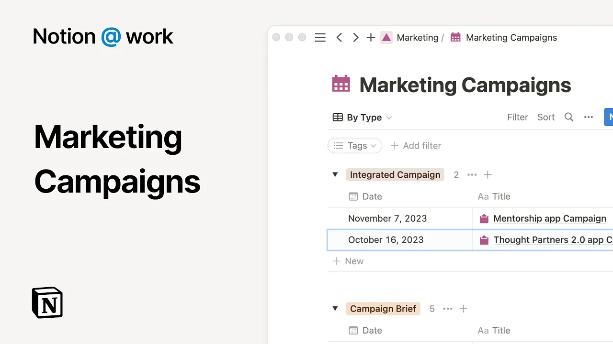

# Notion at work: Marketing campaigns

**URL:** [https://www.youtube.com/watch?v=NDicG6fBGtA](https://www.youtube.com/watch?v=NDicG6fBGtA)
**Date:** 2023-08-08

## Transcript

**[Voiceover]**

"notion is where your teams knowledge and projects come together in a connected workspace in this video we'll share best practices for managing an integrated marketing campaign when you're coordinating with different teams who manage various marketing channels everyone needs to be on the same page with the goals and requirements and it's especially important that everyone has visibility into all"

"the moving pieces and knows which ones they're responsible for notion can help you do this by making it easy to First create a homepage to manage everything related to The Campaign second track and manage the different Channel briefs to help your colleagues stay aligned and third map dependencies to identify risks and keep your projects on schedule a homepage"

"gives you one central place to house all documentation and action items related to your integrated marketing campaign to provide a standardized format for campaign homepages you can build customized templates this keeps your most important information like meetings stocks and stakeholders at the top of the page for easy access and make sure you don't forget to define the key"

"elements for a successful campaign such as your objectives success metrics audience and messaging now let's open one of the team's recent campaign homepages creating a homepage can help your teammates to understand the highlevel strategy and quickly access the relevant documents you can mention key notion Pages directly under the document section this is especially helpful for the most important"

"resources is pro tip to keep your homepage only one click away add it to your favorites at the top of your left hand sidebar before completing your campaign homepage you'll need to host kickoff calls with each of the channel teams to make sure you understand their needs to fully scope your campaign keep a record of your conversations with"

"each team to reference under the meeting section by creating a filtered view for your marketing campaign if you're looking for Creative campaign ideas as you build out your plans use notion AI to help you brainstorm with pros and cons for each idea simply press the space bar to pull up the AI menu and add your prompt the power"

"of notion blocks is that your teams don't need to jump between different tools for documentation and trackers to keep up with their work in an integrated marketing campaign you're working with a variety of of different channels which are often managed by different teams for example you can create a Tracker to house all your campaign briefs for the different"

"teams you're coordinating with this provides high level visibility into your campaign progress with the ability to zoom in and out as needed as you can see here each page is taged to make tracking easier at a glance and because notion workflows are infinitely flexible you can coordinate with your different Channel owners while still allowing them to create the"

"ideal process for their team taking a look at this creative brief for customer testimonials this is a campaign brief owned by the content team it contains its own project overview and outlines the requirements and specifications for this deliverable including success metrics a target audience and budget and with a custom notion AI block baked into the template Channel owners"

"are just one click away from automatically generated action items based on the requirements they've input you can consolidate additional contacts by pasting links to embed content from other tools like customer videos to reference or bookmarked web pages for competitive analysis in notion whoever owns the brief can mold the document however is most productive for the team including inviting"

"any Consultants from their video agency as guests to the page with Notions flexible sharing model you can invite guests here without impacting the permissions for the other pages in the tracker or the campaign homepage once you have all the details in place and are ready to execute on your plan you can use this information to create a timeline"

"for streamlined project management by breaking down your project into manageable tasks and subtasks you can provide a clear execution path for each teammate with a filtered view of their tasks and since projects are always changing Notions flexibility means you can make changes as necessary and communicate updates accordingly no matter you use case or team notion can scale from"

"complex planning docs to Team level projects and down to the Daily work that makes them happen [Music]"

