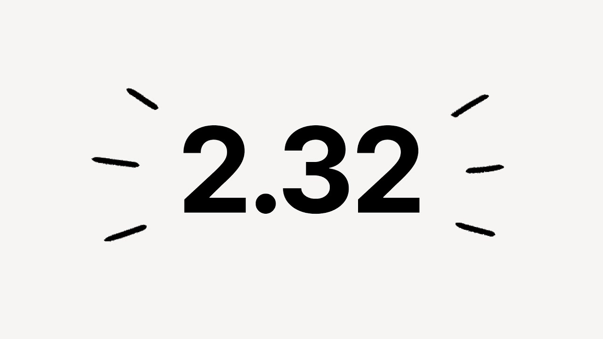

# Notion 2.32: Video Release Note

**URL:** [https://www.youtube.com/watch?v=z7yjLzvFqsk](https://www.youtube.com/watch?v=z7yjLzvFqsk)
**Date:** 2023-08-11

## Transcript

**[Voiceover]**

"I'm always it's the first time we're talking about new features in the video this is notion 2.32 [Music] deep work happens in notion but a lot of other conversations happen in communication tools like slack with this new feature I can add people to an ocean page directly from a slack directory saves me a bunch of time trying to"

"find contact info sometimes you create an AI prompt that just works so well and you want to use it over and over and over again so we made it incredibly easy to do this with AI favorites click on the star icon next to any prompt you've run and you'll see it whenever you summon notion Ai and I'll kick"

"it over to some notion timmies to show off their favorite AI props take it away one of my favorite AI prompts is a brainstorming table and I can really easily click the button to generate it over and over again I use notion AI to pull out action items after we do a roll kickoff when I'm writing I use"

"the prompt to keep this concise but maintain the meaning [Music] after we first released dependencies for timeline view we got a ton of comments access for dependency day shifting you can access the setting through your view menu and decide if you want to shift and maintain time between tasks shift only when dates overlap or not to ship dates"

"at all when your plans change notion adjusts sharing and permissions in notion can be a lot to digest we're working on making this easier and clearer first by cleaning up the UI web publishing options are now in their own tab with new preview functionality and when your page is live you'll see this blue circle our designers also worked"

"on streamlining this part of the share menu with the Privacy level selector check out the new link sharing option all you have to do is share the page link with another member and they'll have access hi I'm Elizabeth here to tell you more about our new Integrations Gallery as you already know notion connects with a lot of the"

"tools that you already use in your day-to-day work with this latest release you can directly search for connections you want to find like figma or GitHub you can browse different categories like analytics or engineering tools and you can learn exactly how to best use the integration to streamline your work hey everyone I'm Annie and I'm on design Tina"

"admission and excited to show you one of my favorite features it's called connected properties connected properties are places you can drop links to figma or Google Drive and I'll create a preview for you I love this because the team can see my designs or files write a notion where the project page lives and nobody asks me Hey where's"

"the link with this page again [Music] hey y'all I got to work on this quality of life Improvement as a part of my onboarding before you had to manually reorder all of your select and multi-select options if you had a ton of options that experience is really terrible now you can easily autosort these options hi I'm a tool"

"I noticed a suggestion from our ambassador Community for making it easier to add end dates in the date picker I thought the idea was great so I implemented it hold shift then click easy hey I'm Austin and I work on the mobile team at notion when you visit a page on your phone it's automatically stored in a local"

"cache and is accessible offline typically for a few days afterwards in this release Pages you visit on the desktop app or website will automatically sync to your phone's cache not only does this help the page load faster when you open it on your phone but it also increases the chance that a page can be used while offline even"

"if you've never opened that page on your phone before foreign [Music]"

