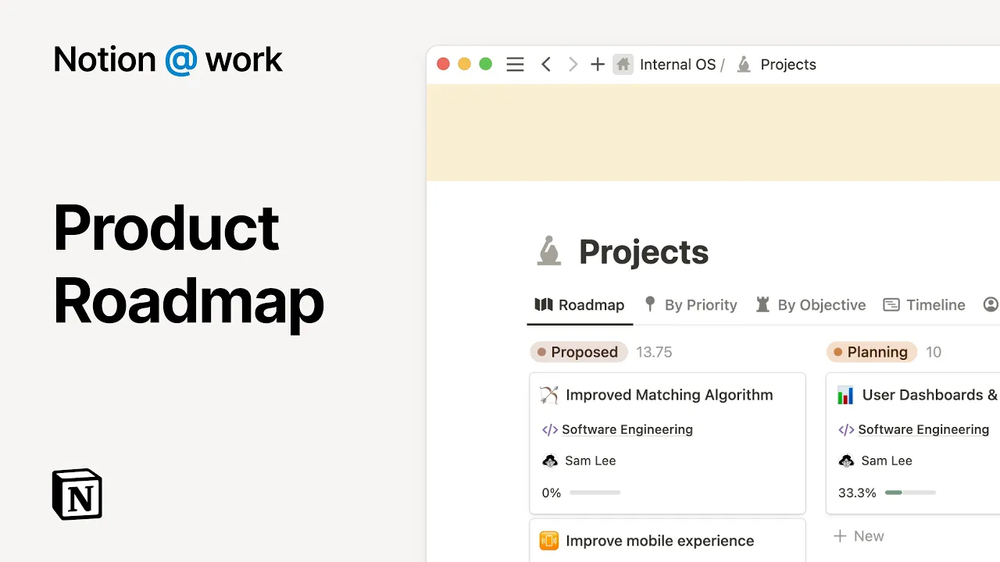

# Notion at work: Product roadmap

**URL:** [https://www.youtube.com/watch?v=ii6R6c5bEmE](https://www.youtube.com/watch?v=ii6R6c5bEmE)
**Date:** 2023-08-24

## Transcript

**[Voiceover]**

"notion is where your company's ideas goals and work connect all in one place in this video we'll show you how you can build an execute a product road map in notion an effective product road map brings everything and everyone together and a great road map is a living plan that connects to company goals documentation responsibilities and more for"

"many companies important information is scattered across various tools creating a fragmented picture of what's on the road map and who's doing what product team on notion don't have to worry about this problem because they can First share one place for all product road map details across teams second connect their product road map to the documentation and tasks and"

"third break down projects into actionable tasks with clear owners projects are housed in a section of the workspace that is shared with everyone this makes it easy for everyone to follow along with new product features from the engineers's building to the marketer's planning launches and even Executives monitoring progress by centralizing your work for all teams and project phases"

"everyone has the information they need to make progress and stay aligned with notion every project is also its own page which means this tracking system doubles as a hub for project plans that's one less tool you have to switch to or doc you have to try and find or update Pages like this are completely customizable and creating templates"

"lets you standardize process for your team now whenever a PM is starting a new project page they have a pre-made framework to use notion makes it easy to connect the dots between your road map and the project details you can mention notion Pages directly in the page content or you can tag your project with documents that live elsewhere"

"in your workspace by connecting to other important contexts like you can see here with company objectives when you centralize dos and projects in notion creating connections between work is as easy as adding a field to your tracker that way you can include all the details related to your road map link to the marketing campaign for this launch or"

"link the related tasks so you can track the completion rates not only can you link other pages from notion or you can connect your road map to other critical tools used for product development like figma design files and GitHub PRS as your road map grows and gets more complex notion helps you stay organized you can tag your road"

"map in a way that works best for your team whether you want to assign owners estimate engineering hours or track the progress of task completion you can customize this in notion and using notion AI to provide summaries and user stories can help your teams quickly understand the projects in your road map when projects are always changing AI summary"

"will automatically update and can be customized so even technical features are easy to understand for everyone you can also use AI to autop populate user stories at scale and help ground your engineering team with customer needs without having to manually update them for every project this structure lets you filter and create custom views of your road map in"

"this view you can see how projects roll up to company objectives as well as how they break down into actionable tasks you can view your road map as a timeline Canon board table calendar and more however you want to create and visualize your road map it's available to you we know there is no one- siiz fitall for building"

"a product road map which is why Notions connected workspace can help you create something perfect for your team this helps you spend less time switching between tools and stay focused on the task at hand if you want an easy place to get started check out our template gallery for pre-built workflows by notion and some of the best companies"

"and product teams"

