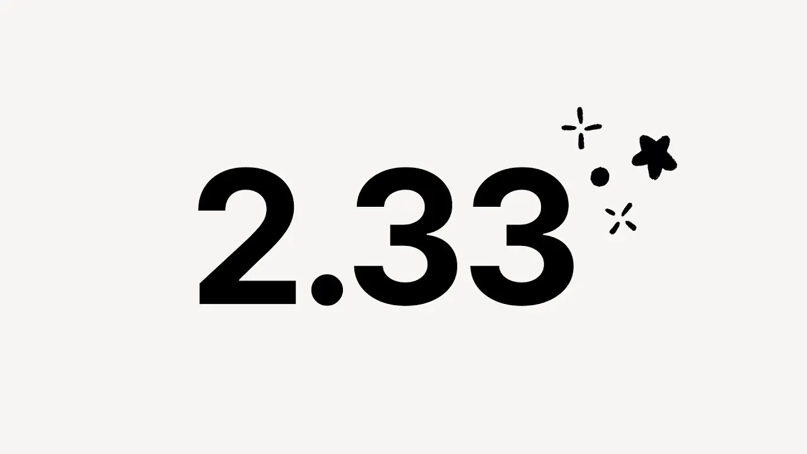

# Notion 2.33: Video Release Note

**URL:** [https://www.youtube.com/watch?v=KZ4QhIUN7I0](https://www.youtube.com/watch?v=KZ4QhIUN7I0)
**Date:** 2023-10-02

## Transcript

**[Voiceover]**

"hi everyone I'm Marina on the product team here at notion and I'm here to introduce notion 2.33 with our second ever video release I really hope you enjoy [Music] it hey I'm Dan from the project management features team our team has received hundreds of letters from folks asking for the ability to create automations on databases we listened we"

"just released database automations when building an automation you'll need to choose a trigger like when a task is marked as urgent and an action like assign it to Alex save it and then you're good to go start putting notion to work for you hi I'm Steven I'm an engineer working on databases at notion we just shipped the new"

"formulas 2.0 update which makes it easier to edit formulas use powerful functions and get rich formatted outputs we hope you enjoy using the new and improved formula language hello this is Lou and I built the AI translate on database feature uh I buil it so your co-workers and clients from all over the world speaking different languages can all"

"use the same database and maybe you can use it to pick up a new language in your personal time [Music] too hi I'm Julie and I'm Jake we got to collab on a really cool quality of life feature maybe you've heard of it it's called Frozen CS it makes it easy to use databases with lots of properties so"

"check it out and let us know what you think Notions new Universal importer allows you to bulk import HTML a CSV or even a markdown plus we've also improved our importers for both evernot and Trello one thing I love is that the notion team always makes time to improve on the small features across notion um this example is"

"called wrap all properties in the board and gallery layouts for a database something so small and simple can make um everything look more organized and really just contribute to your day-to-day workflow pretty excited to share this with youall buttons are a great way to create a page in a database now when setting up your button you can choose"

"a database template to apply when creating your page use Dynamic references like at now and at today and date properties and at me and people properties within the database template now you can set your time zone to defaulty location or you can change it manually by going to settings and members and then my settings hello my name is"

"Tyrus I'm engineer a notion and recently had the opportunity to work on a small quality of life feature now When selecting the three dot menu or hitting command slash there will now be into generically format code for a handful of suppored programming languages such as typescript SQL Json and [Music] rust"

