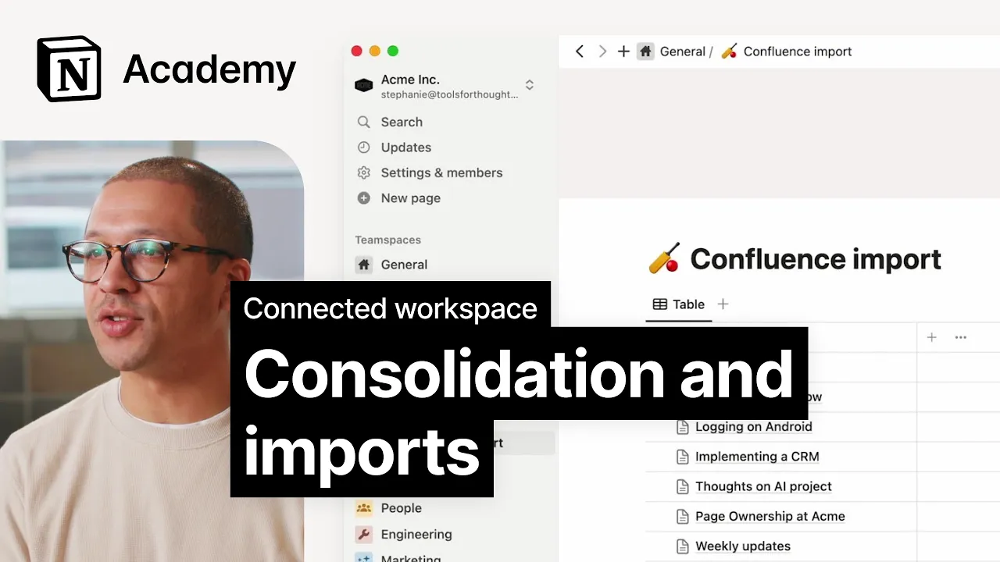

# Importing Data

**URL:** [https://www.youtube.com/watch?v=Z-5ObjftIUI](https://www.youtube.com/watch?v=Z-5ObjftIUI)
**Date:** 2023-11-20

## Transcript

**[Voiceover]**

"[Music] we believe that a connected workspace one where your team's knowledge is brought together can make your work more efficient and enjoyable in this lesson we'll talk about what kinds of work happen in a connected workspace and what you're able to integrate then we'll explore how you can import content into notion to start getting value as quickly as"

"possible building a connected workpace starts by understanding your company or your team's tool stack all of your tools will fall into one of two categories which will dictate how you'll start to bring information over to notion first many tools can be replaced by connected workspace these include document editors AI writing assistants Wiki tools and project management Tools in"

"these cases you want to import content or start from scratch with a template most other tools can be integrated with your connected workspace these are the more specialized tools like figma slack or GitHub you may even have the the opportunity to reduce the number of seats your team pays for in these other tools by making important information available"

"in notion check out the companion guide to look at a list of common use cases notion supports and to create a plan for migration once you have a plan in place you can use importers to quickly and easily bring information into notion Imports will enable you to start taking advantage of some of the most exciting parts of your"

"connected workspace for example after importing content you'll be able to use your AI assistant to query your workspace and quickly get answers to your questions to start an import in notion navigate to the import button on the bottom left of your [Music] sidebar here you'll see options to import directly from various apps for direct Imports you'll need to"

"log into your app and Grant import access to notion once the import is complete the pages will land in the private section of your sidebar or the selected team space and you'll be able to move them as you please for everything else we recommend exporting content from your other app and making use of this Universal importer to bring"

"in files of any type here let's look at two Imports one from Asana and another from Confluence since this imported content exists as a database we can use AI properties to automatically generate a summary of the content we've brought in making it much easier to sort through years of historic Docs plus we can use Q&amp;A to ask questions"

"about this content like when the last engagement survey happened once the rest of our connected workspace is configured we might use the move to menu in the top right of each page to move content into other relevant areas before moving on consider the tools you use on a weekly or monthly basis make a quick list of what can"

"and can't be Consolidated into your connected workspace and use the resources provided here to start your content [Music] import"

