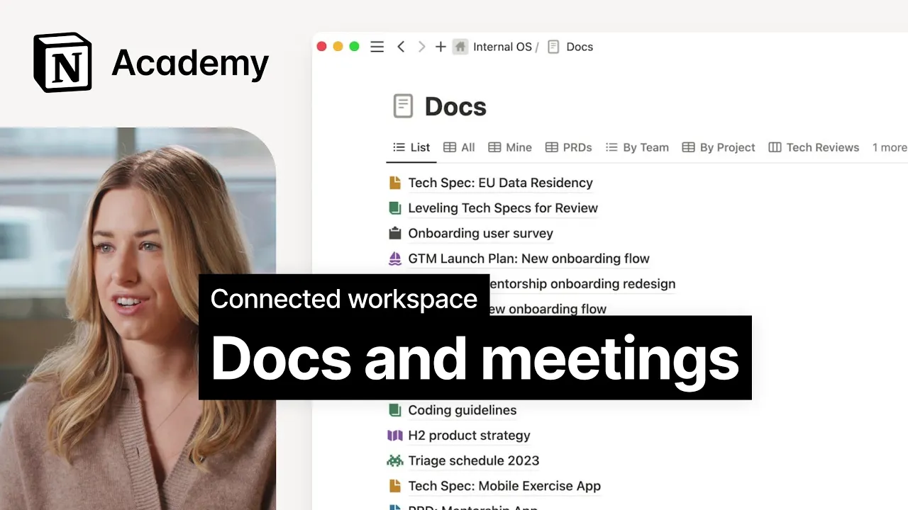

# Docs and meetings

**URL:** [https://www.youtube.com/watch?v=FZeHZ-KznFg](https://www.youtube.com/watch?v=FZeHZ-KznFg)
**Date:** 2023-11-21

## Transcript

**[Voiceover]**

"[Music] in this lesson we'll explore two types of living knowledge docs and meeting notes and learn how you can customize them for your team docs of meetings are your company's Zeitgeist the information people are talking about thinking about and acting on and they're often the missing element from a company's wikis or knowledge base docs capture contexts on active"

"work in the form of proposals prds research reports weekly updates and more meeting notes on the other hand store agendas transcripts and action items from live conversations together these two types of knowledge clarify the status of work creating a download of open questions and key decisions made at a certain point in time this way instead of relying on"

"context clues or word of mouth everyone at the company can reliably catch up on the latest even without being physically present in meetings as your Ze gu Scrolls you'll be able to tag and categorize Pages according to team meeting location and more plus you can add custom tags to help further understand information a few we suggest are AI"

"summaries which provide a quick concise understanding of a Page's content this summary can be incredibly helpful especially when you need to get up to speed on a particular topic or project in a hurry or the status indicator this indicator helps ensure that the information within the doc is accurate and up to dat it serves as a trust signal"

"assuring users that they can rely on the content within the doc doent having a clear status indicator can save time and prevent any potential misunderstandings or confusion finally including the owner information in the doc can allow team members to more easily identify who is responsible for the document and give them a contact to reach out to if they"

"have any questions later on we'll show you how to connect these two knowledge types this way you could be catching up on a meeting you missed and also see all the docs that were tagged as relevant ready to get these going in your workspace if we didn't already have them in our default team space we could use templates"

"to add docs and meeting notes once they're in place like they are here we can add the properties explored in this video using the add a property menu for example here we might add an AI summary property to automatically capture the overview of each meeting note when a meeting note contains any information like a transcript this property will"

"pull out the most important discussion points we can follow the same flow for docs to add a property like this suggested doc stage option looks good our meetings and docs are ready for collaboration by leveraging these tools effectively you can create a workspace that is rich in Dynamic information that Fosters better just in time collaboration add docs and"

"meetings in your workspace before moving [Music] on"

