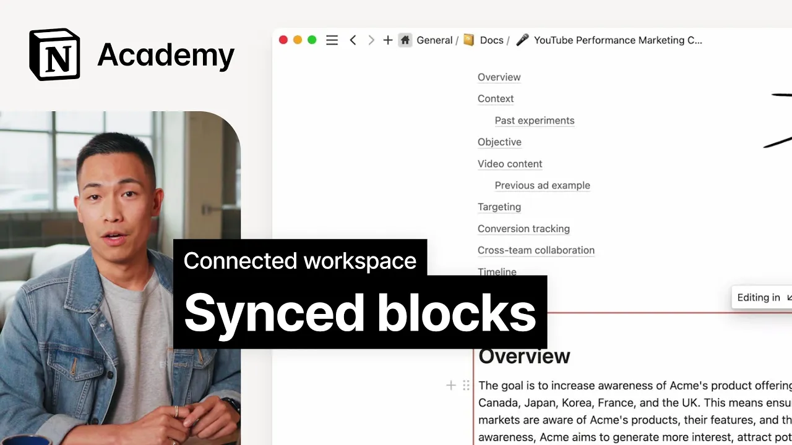

# Synced blocks

**URL:** [https://www.youtube.com/watch?v=iIzpxd06tPs](https://www.youtube.com/watch?v=iIzpxd06tPs)
**Date:** 2023-11-22

## Transcript

**[Voiceover]**

"[Music] within a page you can employ certain block types to make information easier to find in this lesson we'll talk about how you can connect information at a more granular level to make a truly interconnected Web of Knowledge these blocks include things like headings and visuals toggles callouts table of contents and more each of these can help you"

"draw attention to the most important content on any given page and bring ideas from what doc to another for starters let's consider sync blocks in notion sync blocks are sync copies of blocks a change in one location will be reflected everywhere that you have that block synced so if you copy text on one page you can use the"

"past of sync block to keep the same text up to date in another place as a concept these Dat Back to the 1960s when Computing Pioneer Ted Nelson wrote about something he called trans exclusion or the idea that part of one thing is included in another and brought from the original use them to share your team or company's"

"mission statement remind your team of upcoming events in multiple places pull an engineering overviews into a go to market launch plan or even track action items across multiple docs next up page mentions when you want to link to context but not display it in its entirety you can mention another page by simply typing at followed by the Page's"

"name this creates a quick link to the other doc which enables two things a rich preview of that Doc's content and a back link on the other doc to help you navigate to related or connected thoughts more easily finally when you can't capture it in notion use Link previews and embeds to connect information from other tools more on"

"that in our using data course back in acne let's take a look at how these might all come together to form a project proposal for a performance marketing campaign that runs on YouTube to start let's create a section for context using a heading and utilize page mentions to link to past experiments here we'll list all the things that"

"inform this project like this YouTube campaign from 2022 and others then we can pull in a sync block from our H1 company objectives to further establish why this campaign matters to increase awareness about Acme's product offering bringing the text in like this draws attention to the most important piece of context there is in our doc finally we may"

"choose to embed a previous ad example directly from YouTube here as well as a doc Creator we finish this crucial work in seconds for the end reader it's now easier to get a high Lev overview of the project and explore details at whatever level of granularity they feel they need as you start adding content to your workspace keep"

"exploring the power of sync blocks backlinks and Link previews to create a Web of Knowledge happy [Music] connecting"

