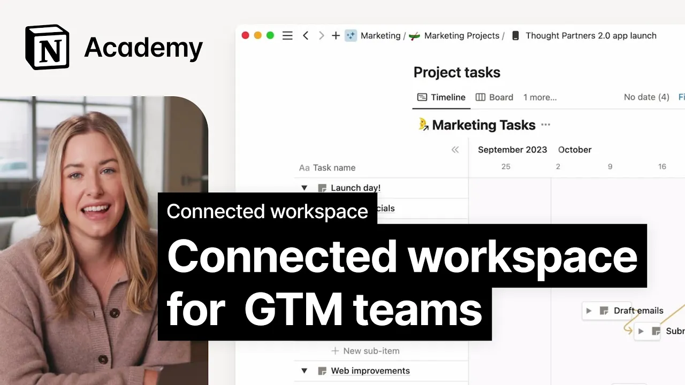

# Connected workspace for marketing teams

**URL:** [https://www.youtube.com/watch?v=0H37EVZn8l8](https://www.youtube.com/watch?v=0H37EVZn8l8)
**Date:** 2023-11-27

## Transcript

**[Voiceover]**

"[Music] when product and marketing teams collaborate on a feature launch it's challenging to keep teams aligned all it takes is a shifting engineering timeline to throw a bunch of marketing activities off track with everyone focused on their own work it's easy for a date to get changed an update to be overlooked and suddenly the group that makes up"

"your go to market team fall out of sync this can lead to confusion Mis deadlines and a lot of frustration back and forth trying to clear up things through email and meetings in this lesson we'll demonstrate how your connected notion workspace with its built-in Q&amp;A assistant can streamline all of this you'll get answers in seconds so you can"

"make necessary changes and ensure everyone keeps up with the latest updates here's an example of how this could work say one of your team members notices the launch date for a project was changed to check you call up Notions Q&amp;A assistant and ask about the Project's launch date it then then correctly informs you that the date has indeed"

"shifted but now you spot another problem it looks like the new launch date might fall on a company holiday you ask notion AI to confirm and it rightly tells you that yes this launch falls on a company holiday now you go back to the project and tag some of your colleagues who all agree that the date should be"

"changed crisis has been averted and when you update the launch date again all your go to market timelines shift accordingly finally with database automation set up to notify your team about deadline changes via slack you're left with little else to communicate to your team and that's how your goom Market teams can synchronize and collaborate smoothly in a connected"

"workspace with a built-in Q&amp;A assistant you'll get immediate answers to your queries without having to search the entire workspace then you can ditch the cumbersome process of pinging messages back and forth and instead make and take action on Collective decisions [Music] fast"

