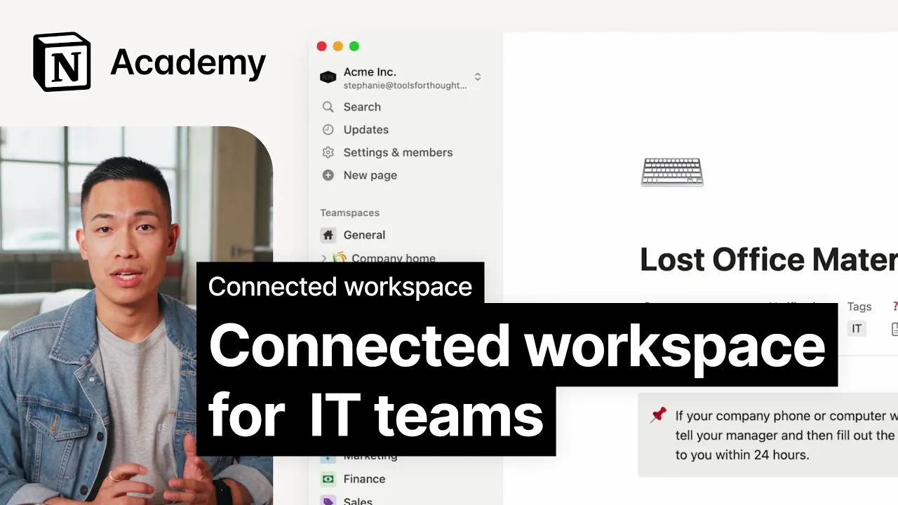

# Connected workspace for IT teams

**URL:** [https://www.youtube.com/watch?v=yG-s8yWn4Pk](https://www.youtube.com/watch?v=yG-s8yWn4Pk)
**Date:** 2023-11-27

## Transcript

**[Voiceover]**

"[Music] departments that handle company information and procedures like people in legal teams are often swamped with questions constantly feeling dragged away from the work to answer employee questions via email and DMS in this lesson we'll explore how a connected AI powered workspace can help put a stop to that cycle team members might not realize that the information they"

"need is documented and readily available in Ocean once team members know how to search for information themselves and everyone benefits they can get accurate answers quickly and conveniently and your people team can earn back time to focus on more impactful work to demonstrate how this works imagine you lost your company phone and you want to know the next"

"steps you could ping a few messages out to your people team and hope someone gets back to you ASAP in the meantime you have to wait and hope you're not missing an important call or compromising company privacy by using your personal device or you can go ahead and find the answer yourself just by asking notion Q&amp;A [Music] open"

"the Q&amp;A chat window and type in hey I've lost my company phone what should I do here Q&amp;A searches the entire workspace and finds a page in the company Wiki which explains the procedure for reporting a lost company device as well as directing you to the page the bot summarizes what you need to do explain that you have"

"to fill out a form to report your device as lost or stolen and that you'll need the key details like the make model serial number plus date and location of the loss now you've got all the information you need you can get straight on with filling out the form and submit it to your it department they can take"

"care of any security risks immediately and you can start the process of getting your phone replaced when you build your company knowledge based notion team members can direct their questions about company policy and procedures to Q&amp;A and they surface the information they need with [Music] ease"

