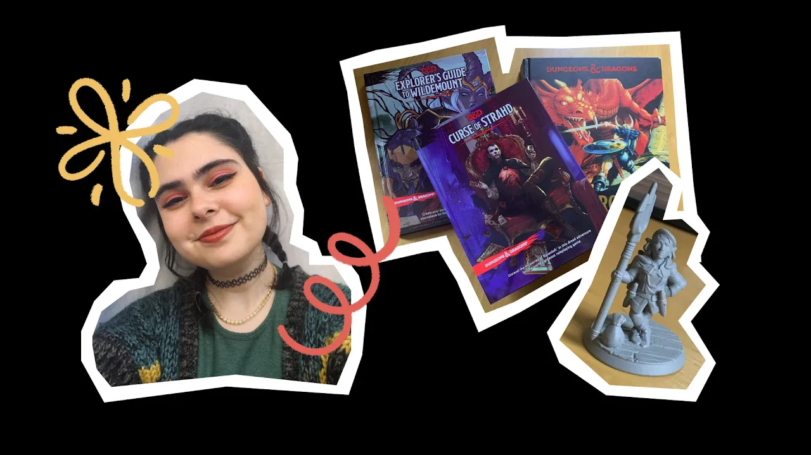

# For role-playing games and real-life hangs | Stella's Notion story

**URL:** [https://www.youtube.com/watch?v=xoNgHk-FnRw](https://www.youtube.com/watch?v=xoNgHk-FnRw)
**Date:** 2023-11-27

## Transcript

**[Voiceover]**

"[Music] my name is Stella Joe I have been playing D and D since 2014 it's just the best game it's like such a good game getting to know Dandy is really daunting because you look at these Source books that come out and they are thick finding notion was really cool because it sort of opened my eyes to seeing"

"how customizable I could make my notes my character sheet I played in a 7 year long campaign as the same character it was very very emotional at the end there aren't a lot of opportunities in real life where you can sit across from your best friends in the world and like really truly tell them how much you care"

"about them playing tabletop role playing games sort of encourages me in my own life to make wider and bigger choices that makes life more [Music] interesting"

