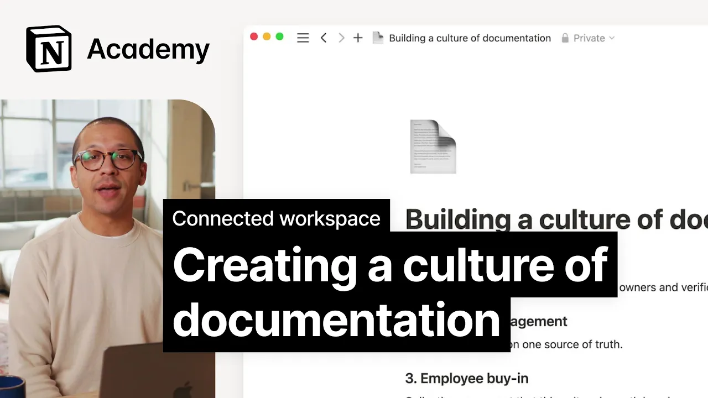

# Creating a culture of documentation

**URL:** [https://www.youtube.com/watch?v=dQKx7V4mNSQ](https://www.youtube.com/watch?v=dQKx7V4mNSQ)
**Date:** 2023-11-29

## Transcript

**[Voiceover]**

"[Music] the final step in realizing the long-term value of your connected workspace is creating and maintaining a culture of documentation within your organization you can have all the wiki pages in the world but unless you work to deeply ingrain documentation in your day-to-day you'll be stuck in a culture of asking which is inefficient in this lesson we'll consider"

"a few common pitfalls in connected workspaces and talk through how you can work with your team to combat these at a high level cultivating a culture of documentation requires clear content governance executive engagement and employee buyin content governance often looks like creating a standard best practice about document owners and verification this helps to avoid the common mentality of"

"mistrust in what is perceived as old or outdated information that lives in your workspace with verification and owners in place team members have more signals to understand the relative accuracy of content Plus plus they have someone they can reliably go to with any questions executive engagement is another key it requires that the leaders in your company be it"

"managers or Executives hopefully both use notion as their source of Truth too if executives are asking for a slide deck or email but day-to-day work is happening in your workspace the information in your workspace will quickly be seen as lesser than once that's the case it can be hard to get it back to combat this consider using the"

"connectivity tools learned here like synced blocks or linked views to create one page reports when needed finally you need widespread employee Buy in the most important thing you can do here is to continually reinforce the culture you want to have that means linking to docs in every slack answer and asking for docs when they're not provided let's consider"

"a quick example of how a knowledge manager might redirect from non-d documentation culture to documentation culture at Acme here someone asks a simple question in slack the knowledge manager could answer the question and move on but that reinforces a culture of asking instead to enforce a culture of documentation they can respond with a snippet from the doc as"

"well as the link Notions handy command control L keyboard shortcut helps you to copy the formatted page name to do this even more quickly what's more the answerer could tag the document owner in the slack Channel who can answer any follow-up questions by implementing the strategies and Concepts we've discussed you'll create a culture where documentation is valued and"

"used effectively remember to prioritize clear content governance engage Executives and encourage employee buyin keep up the good [Music] work"

