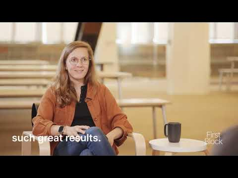

# Love-hate relationship with OKRs by Mathilde Collin, Co-Founder & CEO of Front, on First Block

**URL:** [https://www.youtube.com/watch?v=ThAl8v01Cac](https://www.youtube.com/watch?v=ThAl8v01Cac)
**Date:** 2023-12-06

## Transcript

**[Voiceover]**

"I have a lot of hate relationship with aarius because the um there are many reasons one of them and I think the biggest one is I end up in meetings where we're tracking we're looking at how we're tracking against our goals and we lose the ense or the insights that come with it and so like the truth is"

"we're still early in our journey and so learning is so incredibly important and if I only tracking like how I'm pacing towards our mql like goal Revenue goal da goal and whatever goal I might have like product usage I'm like okay like where you trying to expand in a new market like is it resonating is it not like"

"there is no OK you can Implement that will ever tell you this and okr to lead people to optimize for like the scores and you want like I want the accountability so so we do them but love haate relationship comes from me having to constantly come back to the why and the insights and the learnings and not just"

"the grading I very Mis resonate with that I think I found many times the KR becomes the O and and it sometimes you know hurts the company because people get so focused on the number yeah so you've been a you know a Pioneer in radical transparency among SAS businesses um can you share what it means to you why"

"it's so important I think it's important because I experienced a company that was not transparent and I saw how detrimental it was to my engagement so like I'm not saying like you have to be transparent but usually you take like a work environment or a project you apply transparency to it and things are much better and I've just"

"been convinced that it would lead to more productivity more trust more engagement just everything is better with transparency and I share with the team very often like transparency doesn't mean sharing everything there is good and bad transparency and good transparency helps answer questions and bad transparency help like raises more questions and so I'm not saying like just share"

"everything like for example our um salaries like are not public and I feel very good about this and I I can explain why um but being deliberate about being like being transparent and having this good level of transparency has just yielded to so much trust and everything goes faster but if you just use it like 90% of the"

"way like it doesn't work so there is an art where like you need to be 100% transparent on the things that matter which doesn't mean like sharing 100% of the things and if you master that art I just feel like it yields such great results so I just want to take back to the point you mentioned so let's"

"assume like you know you had a bad quarter right uh I think like a natural sort of entrepreneur sort of feeling is that I need to like hide that thing like talk about like things that are better coming up uh but what I'm hearing from you is a little bit like you got to take that head on share"

"that with the company because that actually can drive more productivity yes uh uh which is worth I think the audience will love to understand that a bit more 100% And I like the reason why I shared previously that I think it's super important to have Frameworks that prevent you from thinking like should I be transparent or not is"

"you have to share the bad results where I'm coming from is people often think that engagement comes from like hyping people like you know giving them energy and so yeah I mean being in front of the company and saying we missed we like really missed this quarter like this is way less energizing maybe than we've done so well"

"like we set these very ambitious goals we've hit them so great and yet I think it is counterintuitive but it is way more encouraging and like will create way more energy for people to know that you're not trying to hide anything I always feel like people can tell like people who you know like either they will talk about"

"another metric that went well and it's like okay but we're not talking about the things that we used to talk like you know just two months ago like people can tell they will lose trust and they will also lose like why they're working on the thing they're working on like if we missed our Revenue numbers it's because something"

"is not working if something is not working we need to work on this so if people connect the dots like I'm working on this because that didn't yield the result expected then there is just more meaning uh so I feel so strongly that you shouldn't listen to you know your fears in the situations and just Implement whatever process"

"you can to prevent you from even thinking about it people always know when we have a bad quar yeah"

