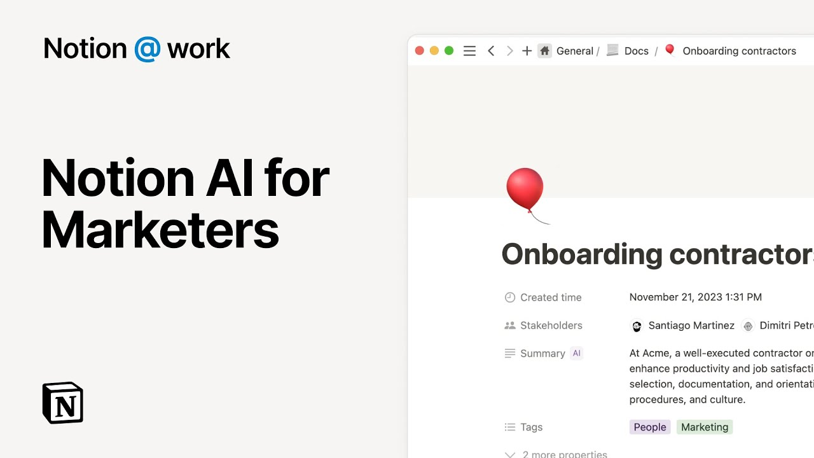

# Notion at Work: AI for marketers

**URL:** [https://www.youtube.com/watch?v=q8c9dmjMatw](https://www.youtube.com/watch?v=q8c9dmjMatw)
**Date:** 2023-12-14

## Transcript

**[Voiceover]**

"as a marketer you often find yourself reading a lot of docs producing content and organizing it for stakeholders notion AI simplifies your work by writing brand new pages for you extracting key insights from database pages and quickly showing you the information you need let us show you how AI can help make you a better marketer without leaving your"

"notion workspace first say a colleague has written a first draft of an email to users that promotes an upcoming webinar there's a quick way to transform this generic piece of text into something more more appealing for your audience use your cursor to select all the text you'd like to change and click ask AI in the formatting toolbar here"

"you'll find options to alter your writing improve it fix the spelling and grammar make shorter or longer change the tone or use simpler language in this case we'll type out this custom prompt followed by the enter key all that's left to do is hit replace selection and change some of the copy if you wish now use AI autofill"

"to surface fresh insights from your database for instance you might want to summarize the content of your marketing dos to achieve this add a new property to your database like so select the text property which you can name summary then click on AI autofill and then the drop down choose summary then click on try on this View and"

"watch the magic happen you can hit save changes turn on auto update if you wish and wrap your summary column so it's readable to anyone perusing this database view this feature can help folks quickly digest valuable information lastly say you have a question about a marketing process you know the answer is somewhere in your workspace and would rather"

"find it yourself than bother your teammates just click on the sparkle icon at the bottom right of your workspace to achieve the same thing you could hit the search bar and select ask AI then write up the question you have as if you were Consulting a teammate AI will scan your entire workspace and provide you with an answer"

"linking to the notion Pages where the information is found as you can now see AI can significantly streamline your work as a marketer by helping you to effortlessly write content quickly find the answers to your questions and efficiently extract insights from your database AI empowers you to achieve more in less time have a go edit yourself and let"

"us know what you think"

