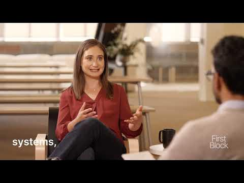

# Building Anthropic by Daniela Amodei, Co-Founder & President of Anthropic, on First Block

**URL:** [https://www.youtube.com/watch?v=6DCEC5bjDqI](https://www.youtube.com/watch?v=6DCEC5bjDqI)
**Date:** 2024-01-04

## Transcript

**[Voiceover]**

"so one uh thing we were talking about before this that you have a very broad role like over looking sort of all of the managers inside the company can you talk a little bit about sort of how do you uh sort of think about this like technical research side of the world at the same time also thinking a"

"lot about sort of this commercial go market yeah and then maybe like the third thing I think a lot is like foundationally how you're building the company up also right uh how do you sort of balance these different areas it's such it's such a good question and it's also evolving as the as the company evolves I you know"

"there's some component of it that feels like any startup right we're we're sort of building the proverbial airplane like while it's taking off but I do think something that is a little unique about it just compared to other places I've worked is we we really started and kind of invested in the research organization for the first you know"

"year year and a half of time we didn't even have a go to market team until 2023 and part of what was so interesting about that was we really almost got to build this kind of cohesive culture with this clear set of goals and then we almost like went and did it again right we said okay now that"

"we've gone and kind of developed these really transformative powerful safe AI systems how can we now sort of bring them to Market in line with our values and I think part of what's been so like incredible about that journey is it's you really you really like you build one one part of the airplane right we're like okay we"

"actually have the base now and now we're building the controls right or we're flushing out the wings and of course there's times where you're like oh man like this knob I should have like that knob I built it too slow I should have built this other knob you know slower but but in general I think it's it's part"

"of the like joy and uniqueness of this type of business to be able to have research impacts and publish papers and have policy impact right and coordinate with governments and Civil Society and also be a a tech startup right that's building a product that's pushing it to customers that's seeing how the technology is really being used in the"

"world on kind of a day-to-day basis do you have a schedule like how do you think through like if you're like like let's say this week is there a way you think about these different things sort of like different days or or or or does it change every quarter every six months well let me tell you the like"

"perfect day the perfect week of what it would look like and then a little more in reality every you know everyone has their own kind of quirks but there's so much context switching in any kind of management or leadership role but I think for a place like anthropic in particular it's really it's really heightened right because thinking about"

"safety papers and what we're publishing and the research we're developing and what areas we should be exploring is really different from trying to go win a big customer or build interviewing ahead of product right those are just completely different parts of your brain and so I'll I generally try to have my days a little bit aligned like focus"

"on research on Monday and policy and comms on Tuesday and Engineering on Wednesday in reality it's probably like 70% hit rate just because things come up interviews or rescheduling or things like that but you it sounds a little bit tactical but I do think having sort of a little bit of of space to really go deep on each"

"of the areas is is kind of the the dream"

