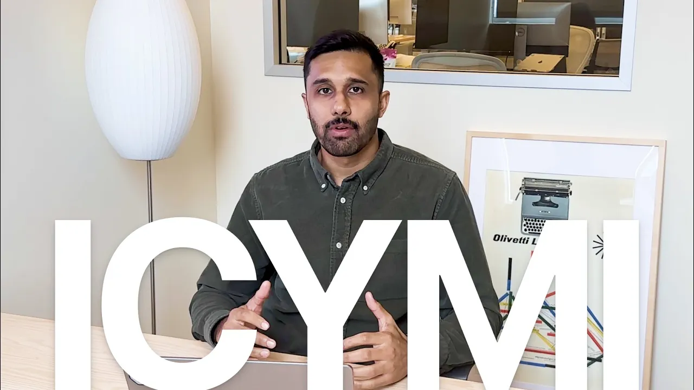

# Notion's favorite Notion features from 2023

**URL:** [https://www.youtube.com/watch?v=OuQ93oDu6ic](https://www.youtube.com/watch?v=OuQ93oDu6ic)
**Date:** 2024-01-16

## Transcript

**[Voiceover]**

"hey I'm a from the notion team notion shipped a lot of features last year 90 to be exact that's a lot to keep up with you probably missed a couple so we created this page to make it super easy to understand and see which features we shipped we organized it by categories things like Integrations quality of life top"

"10 and you can actually click through tabs to see each category or if it's easier you can also just filter through them and now I'm going to pass it off to our team to actually show you some of our favorite features hello I'm Hillary and I work on the finance team at notion and my favorite feature of 2023"

"is the notion integration with cron you can attach notion docs to your calendar events pre meeting you just join the meeting and open your meeting notes at the same time try it out hi I'm Tyler a product designer here at notion one of my favorite features of 2023 has got to be automations it's great if you want to"

"be automatically assigned a task when designs are needed or get an alert in slack when a status has changed give it a shot if you haven't already hi everybody I'm Connie I'm a product manager here at notion on the editor documents and Wiki team my favorite feature of 2023 was definitely AI Q&amp;A I don't know about you but"

"keeping track of information can be hard and with AI it just becomes so easy give it a try take a look through the page let us know which ones are your favorite and in 2024 we're going to continue improving the [Music] product"

