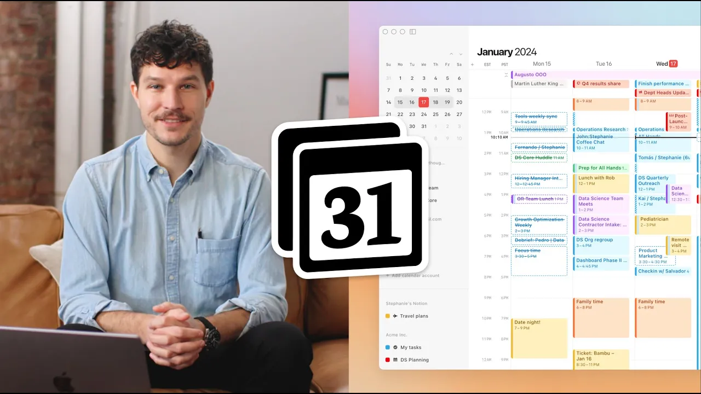

# Meet Notion Calendar

**URL:** [https://www.youtube.com/watch?v=C4Q2ezioTUM](https://www.youtube.com/watch?v=C4Q2ezioTUM)
**Date:** 2024-01-17

## Transcript

**[Voiceover]**

"Hi, I'm Raphael, and on behalf of the entire Notion team, I'm thrilled to announce Notion Calendar, a new way to manage your most precious resource: time. Our vision at Notion is to bring the time layer into every aspect: notes, projects, tasks, so you can make the most of your time. Let me walk you through the experience. Imagine a"

"unified view showing both your work and personal life. This allows for powerful workflows like easy blocking time for my daughter's doctor's appointment. Staying focused and on top of your schedule is easy when you can move between deep work and meetings seamlessly. Instead of using additional tools for scheduling, Notion Calendar has its own scheduler built right in. This makes"

"it easy for others to grab time on your calendar, avoiding any email ping-pong. Once a meeting is set, you can search, attach, and even create Notion pages directly within your event. And my favorite integration yet, display key dates or milestones right from your Notion Databases. We are reimagining what a modern day calendar can do for you, and we're"

"just getting started."

