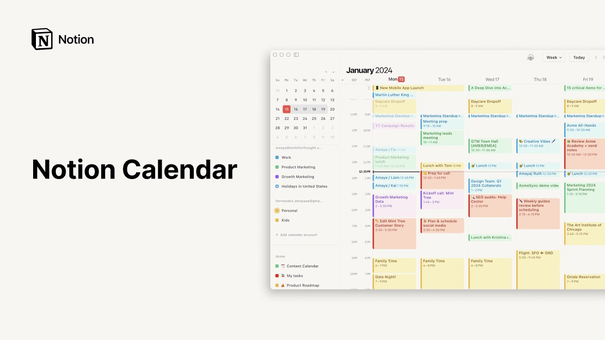

# Notion Calendar

**URL:** [https://www.youtube.com/watch?v=tfrgpkksRfs](https://www.youtube.com/watch?v=tfrgpkksRfs)
**Date:** 2024-01-17

## Transcript

**[Voiceover]**

"with notion calendar you finally have a calendar app that marries your schedule with the rest of your work in notion view all your professional and personal commitments in one place collaborate effortlessly with colleagues in any time zone and navigate to your notion pages with one click notion calendar sys with Google so you can add your calendars and manage"

"work and personal events from one app to connect to Google Calendar click at calendar account select your calendar and go through the steps to verify your account now now with your Calendar's connected you can see all your upcoming events in notion calendar most calendar apps are separate from where you do your work but because notion calendar is directly"

"connected to all the rest of your knowledge and projects switching between work and scheduling is seamless in your workspace sidebar go to calendar at the bottom then follow the process of connecting your workspace in the notion calendar app you can connect your personal task tracker to manage all of your tasks to do in your calendar if you provide"

"a start and end time for tasks they'll appear as blocks on your calendar if you move them in your calendar you'll see the date change reflected in notion as well view product launches as events on your calendar by connecting your teams road map or sync your content calendar to keep up with publishing deadlines when you click on any"

"event from a database you can instantly go to the corresponding notion Page by clicking open in notion create a new event by double clicking a slot on your calendar name your event adjust the start and end time and optionally make it a repeating event if you wanted to reappear in your calendar every weekday once a week once a"

"month and so on view and invite participants and add an office room and conferencing link as necessary you can also attach any relevant documents here and navigate to Connected notion Pages if you need to reschedule an event simply drag and drop to another slot on the calendar grid easily arrange meetings that work for everyone across different time zones"

"in notion calendar you can adjust your default Time Zone by clicking on the time zone at the top left of your grid and add up to three additional time zones to see how schedules align at different locations and quickly find the best time to meet with International colleagues to share your availability with people outside your organization go to"

"share availability in the menu on the right and drag across to mark your free time in your calendar then click create to save the snippet and send it to anyone notion calendar is equipped with plenty of shortcuts to help you get around the grid efficiently and see what matters most to you at any time wherever you are in"

"the calendar find your way back to today by hitting T press J to skip forward to next week or next month depending which view you're in K takes you back to the previous week or month use the arrow keys to navigate backward or forward by the number of days displayed in your grid Hit N to go to your"

"next upcoming event shift command e lets you toggle between showing and hiding weekends and you can view all shortcuts and customize them by pressing the question mark toggle between day week and month view by clicking on the top right dropdown and even when you navigate to another app you'll see a handy countdown to your next meeting in the"

"menu bar and that's it notion calendar brings all your events in one place where you can manage your schedule catch up with colleagues and quickly access relevant information in notion with one click"

