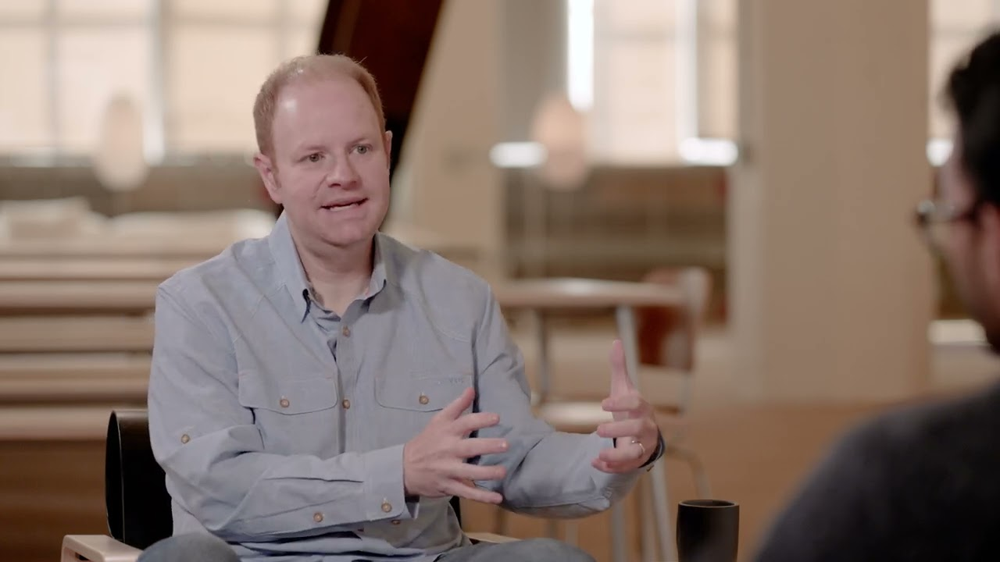

# Building a Successful Product by Parker Conrad, Co-Founder and CEO of Rippling, on First Block

**URL:** [https://www.youtube.com/watch?v=p9X4UYQ8lOo](https://www.youtube.com/watch?v=p9X4UYQ8lOo)
**Date:** 2024-01-26

## Transcript

**[Voiceover]**

"[Music] you want to look for um product areas where integration with your other products matters where integration with your the underlying source of truth in your system you know unlocks a lot of product capability where the the middleware capabilities the platform layer you know things like analytics and role based permissions and workflow automations the specific ones that you've"

"invested in matter in that new product area and are going to allow you to build a better product as a result of that than sort of your points s competitors and all else being equal you want products where there's an opportunity to sort of sort of play games with pricing um to sort of win on a pricing perspective"

"with the bundle um Visa like Point solution competitors and so that's that's the other thing that we those set of things are the things that we look [Music] at"

