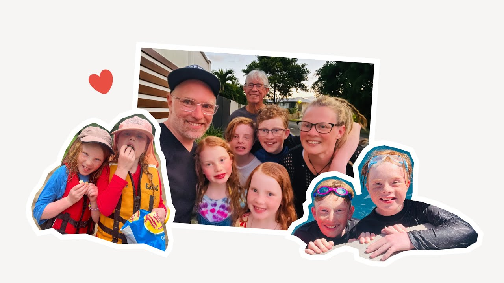

# A way to put family first | Jay's love story

**URL:** [https://www.youtube.com/watch?v=zSk6yk8YMb8](https://www.youtube.com/watch?v=zSk6yk8YMb8)
**Date:** 2024-02-16

## Transcript

**[Voiceover]**

"I am a nurse and a mother of four and I lead a pretty busy life my oldest boy has Down syndrome and my kids all had OCD and ADHD so we came up with a system and yes it was in notion if you've got a system that works for you whatever it is then it means that you can"

"kind of put it aside and get on with life having kids just really opens up your mind and your world um to love that you never knew that you could have for anyone else"

