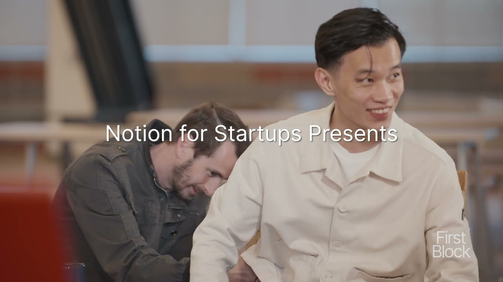

# First Block: The Trailer - Interview with Ivan Zhao and Simon Last, Co-Founders of Notion

**URL:** [https://www.youtube.com/watch?v=7CH3Cb5gR7E](https://www.youtube.com/watch?v=7CH3Cb5gR7E)
**Date:** 2024-03-18

## Transcript

**[Voiceover]**

"[Music] I think startup goes through so many ups and downs it's a co-founder is not necessarily the person you you start a company on the very first day it's the people who went through the up and downs together right we're supposed to hang out with all our employees and uh the two of you decided to lock yourself in"

"a room and essentially like get this prototype out that really sort of inspired the company um to sort of really invest in AI then all of a sudden there's a new car engine drop in that's language model new type of Lego blocks drop in it's completely changing how I think how we think about product and notion uh I"

"think it deserves changing how the industry thinking about knowledge work thinking about tools if you can it's better to build for yourself at at first like like you're the person designing and using it as you're building it and I think to this day like a big percentage of it is we're building for ourselves you we're trying to make"

"a tool that we actually want to use every day how can we create better version of of programming environment better version of software better version productivity tools to get more power out this for all the billions people who use this computers every [Music] day"

