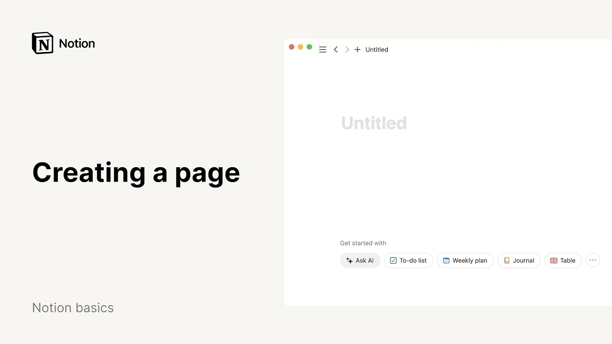

# Creating a page

**URL:** [https://www.youtube.com/watch?v=powfWYn6570](https://www.youtube.com/watch?v=powfWYn6570)
**Date:** 2024-04-17

## Transcript

**[Voiceover]**

"hey there in this video we'll show you how to add a new page to your notion workspace every new page that you create is a blank canvas where you can add whatever content you like from plain text and images to lists and Powerful databases all pages in your workspace live in the left hand sidebar to create a new"

"page you can click the new page icon symbolized by this pen and paper icon the page will be automatically added to the private section of your sidebar and you can move it to wherever you want in the workspace later give your page a name and start writing something in the body of the page for a head start hit"

"ask Ai and come up with a writing prompt that's all you need to start creating a notion as your workspace matures there's lots of options for capturing your knowledge for example if you already know the place where your new page should live simply hit the plus sign in the sidebar click next to a team space to add a"

"top level page or click next to a top level page to add a subpage inside to Nest a new page within the current one type the for slash key followed by the word page this will create a new page automatically stored in the page you chose if you're using notion on your browser try typing notion. new in a"

"new tab this will also create a new page this time in the private section of your sidebar in your new page click on the option that suits you best or hit the three dot button to turn your empty page into a database you may also import already existing data into your new page or check out our template picker"

"to add a pre-built template to see a list of the different types of content you can add to your page just type the SL command and let's add a memorable icon to our page to make it easier to find later well done you're ready to turn this page into whatever you like"

