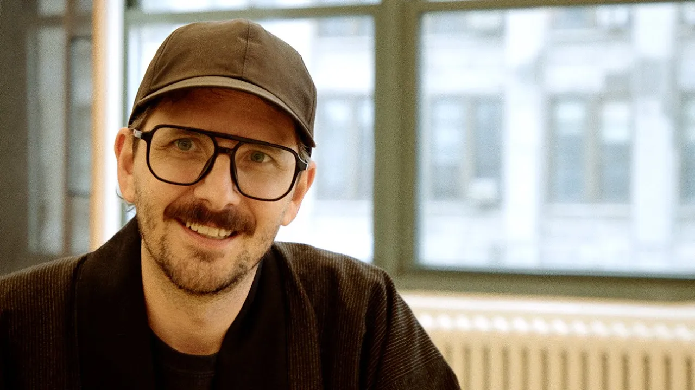

# Meet Randy

**URL:** [https://www.youtube.com/watch?v=DqHSEaUuOnk](https://www.youtube.com/watch?v=DqHSEaUuOnk)
**Date:** 2024-05-16

## Transcript

**[Voiceover]**

"My name is Randy and I support our design&nbsp; team as the new Head of Design at Notion. Where did you grow up? I grew up in the suburbs of Orlando, Florida. I love Disney World, which I think informed a lot&nbsp;&nbsp; of my love for well-considered&nbsp; and wholly designed experiences. What was your first job? My first job was answering"

"tech&nbsp; support phone calls for a dial up ISP. So helping people use the Internet. What is an abecedarium? An abecedarium is...&nbsp; at its most simple form. A list&nbsp; of things in alphabetical order. I love them because it seems really rational,&nbsp; but you can put anything in alphabetical order,&nbsp;&nbsp; which means you can kind of surprise and delight&nbsp; depending on"

"what you choose to put in the list. What's your favorite letter of the alphabet? I think I like J. What is your least favorite&nbsp; letter of the alphabet? I What advice would you give to a young designer? I would give any young designer&nbsp; the advice to just try. Often if we think too hard about it,&nbsp;&nbsp; we end up"

"making judgments about what we&nbsp; think of something. But often if you try it,&nbsp;&nbsp; you'll discover something in the act of trying&nbsp; and you might come to different conclusions than if you thought about it too hard in advance. Awesome."

