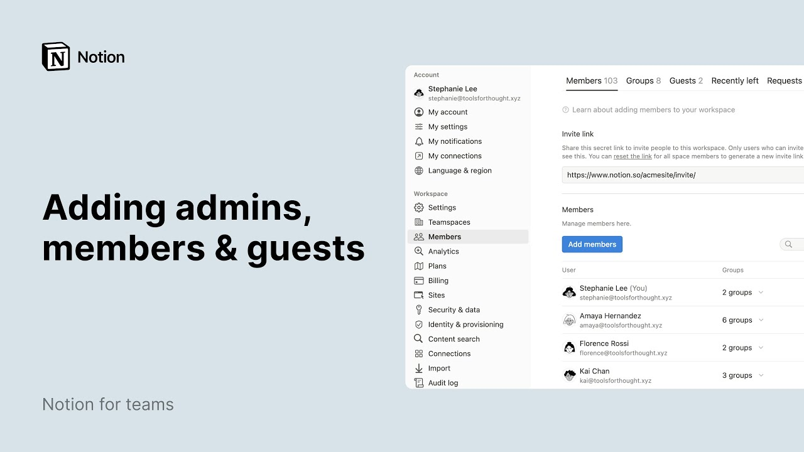

# Admins, members & guests

**URL:** [https://www.youtube.com/watch?v=2DNoq4dmmh8](https://www.youtube.com/watch?v=2DNoq4dmmh8)
**Date:** 2024-05-24

## Transcript

**[Voiceover]**

"in notion you can customize permission levels so that your colleagues collaborators and clients only have access to the pages and settings they need let us show you how notion is built to scale with your team as you grow so the different permission levels help make sure your workspace works the way you wanted to for 10 people or 10,000"

"people in the member section of settings and members you can see the list of all the people in your workspace every person is featured with their name email and access level as well as a team spaces and groups they belong to access level dictates the default permission levels that a user will have while groups team spaces and Page"

"permissions can all be used to Grant more granular access for specific content there are different types of users in a notion workspace commonly most people in your organization will be workspace members this means that they will be able to view create and edit pages in notion you will likely need to collaborate with people external to your company people"

"who you might want to sh a few notion pages with but not your entire workspace in notion we call these people guests you can find their names and emails in the guest tab as well as the pages that are being shared with them so what's a workspace owner workspace owners can view create and edit pages in notion just"

"like members but they also have admin powers like being able to add and remove members change workspace settings and update building information in the Enterprise plan workspaces there's another admin role the membership admin membership admins May manage workspace and group memberships but cannot add first members to the workspace and what are team spaces they are collaborative spaces within"

"notion that can be tailored to the specific needs of a team they serve as a central hub for teams content discussions and workflows a workspace owner can create oversee and manage team spaces here each team space has its own set of permissions so that sharing can be precisely tailored to your organization needs for instance a teamspace includes teamspace"

"owners and teamspace members with owners enjoying full access to teamspace Pages as well as the ability to edit teamspace settings it's worth noting that anyone whether a workspace owner membership admin or member can also become a team space owner granting them special permissions over the administration of just the team space they need learn more about team spaces in"

"this video there are several ways to add new members to your workspace first workspace owners may use the ad members button and enter their email address here you can select workspace owner membership admin or member status here then hit invite they'll receive an email with a link to this workspace to make joining easy to allow anyone from a"

"specific email domain to join a workspace go to settings here you can manually type in your email domain and automatically allow anyone with said domain to join the workspace anyone with an email address tied to the email you just allowed can join the workspace by clicking on this link click update to save your changes finally notion provides single"

"sign on functionality for business and Enterprise customers to access the app through a single authentication Source this allows it administrators to better manage team access and keeps information more secure and if you're on an Enterprise plan you'll have the option to set up skim in your workspace to manage provisioning users and permission group now let's dive a bit"

"deeper into the other options you have for workspace members in notion groups are used to manage page permissions and teamspace access they allow you to easily manage these permissions in bulk rather than on an individual member basis from Members click on the groups tab to view all groups in your workspace their members and the team spaces the groups"

"belong to workspace owners May access the recently left tab where they can see the users that were previously part of the workspace and the past 30 days to find someone quickly look up their name or email in the search bar built to this effect workspace owners and membership admins can change a person's access level from this dropdown this"

"is also where you can remove a member please note that when you remove a member they'll immediately lose access to any of the private Pages stored in this workspace to invite a guest from outside your team to view or edit a page navigate to the Page's share menu let's say your sales team is working with a contractor and"

"they should should only have access to the sales CRM enter your guest's email address in the share menu at the top right of your page you can also choose what level of access they should have to the CRM they'll receive an email letting them know that they were invited to this page if they don't already have a notion"

"account they'll be prompted to create one to continue if your workspace is above the guest limit for your plan new users that you share content with will be automatically added as a workspace member if they belong to your Workspace Email domains to quickly share a readon page with someone who doesn't have a notion account just hit the publish"

"tab then publish again to publish it to the web and share the link with them this is a great way to give your clients visibility into the projects you're working on even if they're not a notion user like you check out this video to learn more about publishing notion pages and that's a wrap as you can see Notions"

"flexible permission levels are designed to scale with your team's needs ensuring the right access for every colle collaborator whether you're a small team or a large organization managing internal members or external guests notion has got you covered so go ahead and start inviting your team to notion [Music]"

