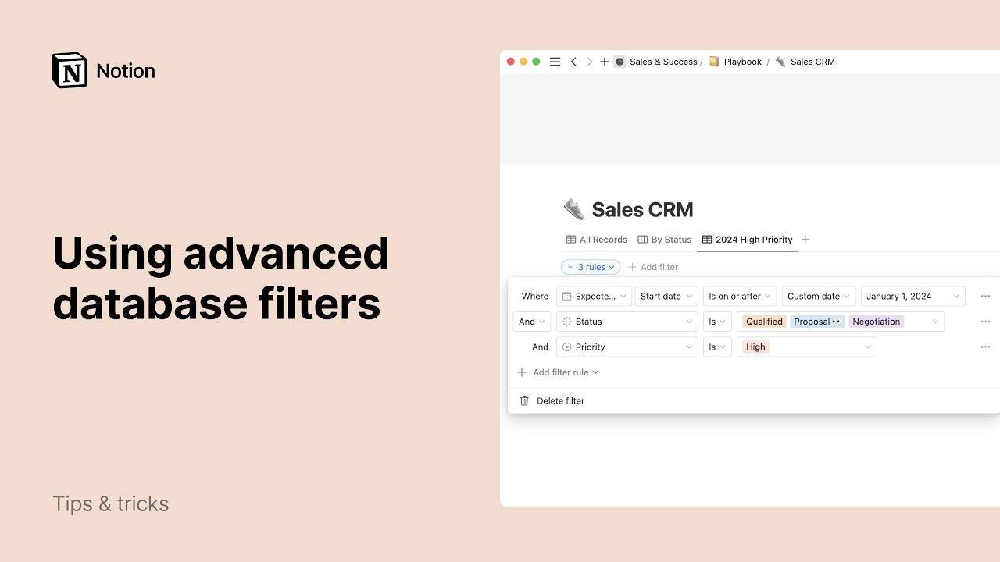

# Advanced database filters

**URL:** [https://www.youtube.com/watch?v=EWoz404YIeU](https://www.youtube.com/watch?v=EWoz404YIeU)
**Date:** 2024-05-24

## Transcript

**[Voiceover]**

"notion databases let you store large amounts of data and visualize your content across tables calendars boards and more with Advanced filter capabilities you can make your database views even more powerful in this video we'll show you how to use Notions nested database filters and how they can make your daily workflows more efficient consider this people database which is"

"a central hub for information on all individuals in the organization this can include a variety of data fields such as contact information Department role and more by leveraging Notions powerful database capabilities you can create custom views to filter sort and search the employee directory each view of this database offers a different perspective of the same data set for"

"instance the design view has a filter to only show employees working on the design team plus you can combine multiple filters using an or logic this allows you to create highly specific views of your data tailored to your unique workflow needs in the new Joiner SF view you'll see that the filter being used is much more specific the"

"entries shown in this database view have to meet the following criteria they need to display a start date from the same month or the past month relative to today as well as show a location that is in San Francisco each of the boxes in this window represent a filter group these come in handy when you need to combine"

"n logic and or logic in your filter next we'll demonstrate how to create a similar filtered view from scratch using a sales CRM template for example to display high priority open sales opportunities for this year and their estimated value click on the plus sign at the top of the database menu let's name our new view 2024 high priority"

"and select table as the layout first let's add a filter so that we're only looking at deals for 2024 click on filter then select expected close which is a date property click on expected close hit these three dots then add to Advance filter now let's show deals whose expected close date is on or after the custom date of"

"January 1st 2024 deals older than this date should now be filtered out of this view next let's filter by deal status click add filter rule again you'll see an and or drop down appear next to the second filter here select the status property and let's add all deals that are currently in progress now let's add that on top"

"of this and need to be tagged high priority in general you only need to worry about filter groups if you want to combine n logic and or logic in your database view in this example we want to show deals that meet the date criteria and where the status is in progress and that are high priority with the three"

"dot icons to the right of the filters you can turn a filter into a filter group duplicate or delete your filter click here to save this filter for everyone your team hover your mouse under the estimated value column and select sum now you have the estimated value of your high priority 2024 deals that are in progress to access"

"or edit your filter rules click here and if you want to share this view with a teammate all you need to do is go to the Views menu symbolized by this three dot icon then copy link to view when they click on your link they'll be taken straight to the 2024 high priority view of this database we hope"

"this detailed helps you take your notion databases to the next level leading to more streamlined workflows and enabling you and your team to work better together"

