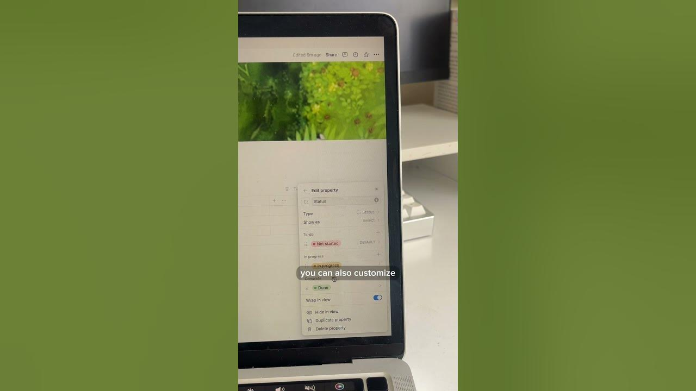

# How to make a basic assignment tracker on Notion  #backtoschool #notion #student #schoollife #school

**URL:** [https://www.youtube.com/watch?v=w5FfGL9RVB4](https://www.youtube.com/watch?v=w5FfGL9RVB4)
**Date:** 2024-08-23

## Transcript

**[Voiceover]**

"here's how you can make a basic assignment tracker on notion that will help you be organized and Achieve an academic comeback this back to school season to create your own tracker just open notion and add in a table consisting of all the columns for the assignment du dates and the progress along with that I will be putting in"

"the courses that I have for this term such as biology English or history and what's exciting about this is that you can also customize the colors based on your aesthetic I I will also be creating a calendar so that I will be having a visual representation of the assignment track and this is why I love notion because it"

"allows me to keep track on every academic workflow that I have"

