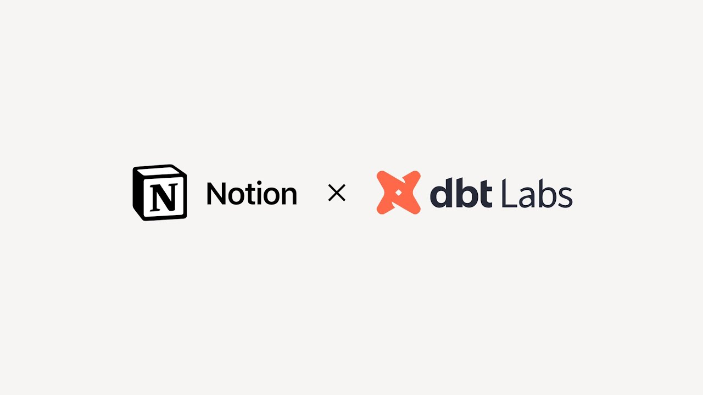

# How dbt Labs avoided years of SaaS costs and scaled organizational knowledge with Notion AI

**URL:** [https://www.youtube.com/watch?v=3LXAfd8VBek](https://www.youtube.com/watch?v=3LXAfd8VBek)
**Date:** 2024-09-25

## Transcript

**[Voiceover]**

"almost overnight when notion AI was enabled the lighthouse had been turned on it really uncovers a wealth of documentation the employees may not even know they needed but makes their work a lot easier it enables people to selfs serve and fuel that knowledge transfer faster than we could have imagined the thought of going back and not having that"

"easy access to information was like oh no it's made it significant impact [Applause] [Music]"

