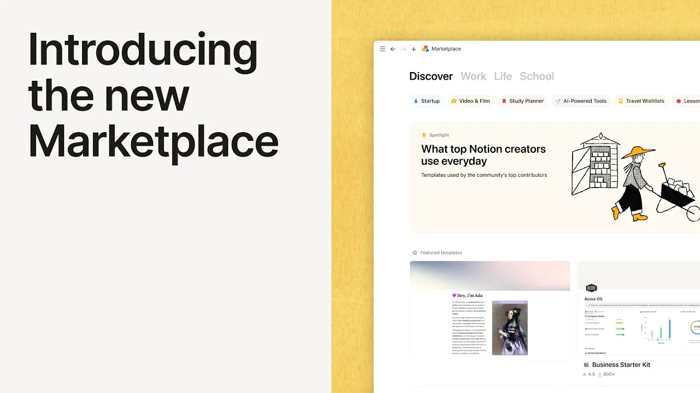

# Introducing Marketplace

**URL:** [https://www.youtube.com/watch?v=gjveGaZPcpI](https://www.youtube.com/watch?v=gjveGaZPcpI)
**Date:** 2024-10-24

## Transcript

**[Voiceover]**

"at first I just used it as a notetaker I was making YouTube videos every single week these are helping me and honestly this is what saved my business over the last couple years maybe it could help somebody else I've built this I think it's valuable and so I put it out there and within a few months we were"

"making 15K a month I think what's exciting about the new Marketplace is that it's going to allow us a load of ways to look after our work and look after the customers interest in trying something the thought of giving them the ability to just go into the app and install their template right there that's just something that's going"

"to be way easier for them to do it's going to be really helpful to be able to do payments reviews feedback delivery all through that one platform having the payment s directly on notion I think that's also help simplifying good process motion's going to basically handle that for you which means you get to focus on making templates and"

"marketing them and serving your customers not becoming an accountant in your spare time having this IP protection and being able to offer the refunds I think that is such a game Cher for not only template creators but the end user that is something as creators are worry about because these are digital products we sell them through links so"

"we don't have control over our partents being able to see the number of downloads seeing the engagement seeing who's purchasing it it tells you where you can invest your time and how you can keep adding value having those comments come back in those reviews about the templates and about what they're doing for people yeah it's the thing that"

"keeps keeps you going as a Creator I really think this benefits creators who want to spend a lot of their time focusing on building a great solution without having to worry about doing paid ads or building up a huge YouTube channel the marketplace is a great place to start because everything youve done for you I think that's such"

"a huge opportunity that notion has provided so many creators that they can now turn this into a living and that is incredible to me [Music]"

