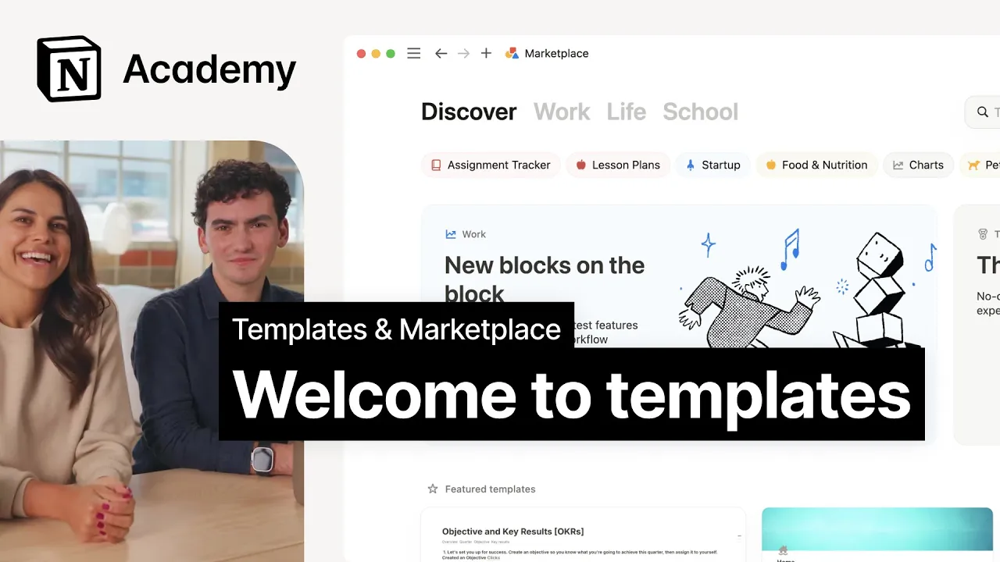

# Introduction to templates and Marketplace

**URL:** [https://www.youtube.com/watch?v=8o02_2B_MxM](https://www.youtube.com/watch?v=8o02_2B_MxM)
**Date:** 2024-10-25

## Transcript

**[Voiceover]**

"hello and welcome to the templ Creator course in this course we're going to talk you through everything you need to know to create list market and even sell templates in Notions Marketplace I'm Rachel and I lead our Marketplace Discovery team and I'm Sam and I'm the product manager working on Marketplace throughout this course we'll pop in and out"

"to show you the various elements of being a template Creator from using the marketplace platform to list and sell templates like these to getting discovered on the marketplace and growing your business anyone could be a template maker a a content creator a student all that matters is that you're comfortable working and building a notion if not we recommend"

"checking out some other courses in notion Academy before going much further whether you've already started listing templates in the marketplace or you're just getting curious this course is a great place to learn along the way we'll look at tons of successful examples of Creator profiles inspiring templates and proven marketing strategies that can help Drive customers to your templates"

"and you'll get a chance to hear from our template creators themselves and all strategies that they use to create and Market templates that people actually want I'm a full-time notion Creator and uh that's my child I build in notion all day which is wonderful I completely changed career paths because of this and I found something I'm really passionate"

"about and something that I'm good at within a few months we were making 15K a month by the time we're done you'll be ready to create awesome notion templates and share them with the world so grab your favorite snack and let's get started wait Sam let's answer the most important question of all what is a template okay stay"

"stay with us for a minute here when we're talking about templates we mean a predesigned page or set of pages that notion users can duplicate and customize for their own workflows and needs exactly and there are a lot of things to a lot of different people for some they serve as a source of inspiration and a way to"

"learn about notion features and use cases for others they Kickstart workflows providing ready-made structures for common tasks and projects so that people can spend less time setting up and more time getting things done for businesses they'll help save time and connect work across teams in this course we're going to talk about them all I would say go for"

"it it's a learning process just start do it if you fail you learn like fail fast fail cheap just do it just like Michael Scott once said of Wayne grety who once said you miss 100% of the shots you don't take ready ready let's go [Music]"

