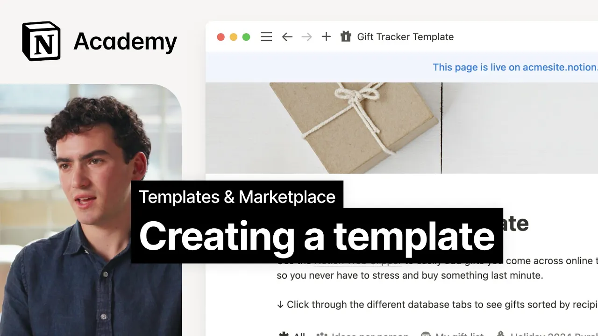

# How to create a great Notion template

**URL:** [https://www.youtube.com/watch?v=W4p7tntGYQg](https://www.youtube.com/watch?v=W4p7tntGYQg)
**Date:** 2024-10-28

## Transcript

**[Voiceover]**

"[Music] the very first step in becoming a template Creator is of course making a great template in this video we'll cover the key aspects of template creation that result in great digital products for the purposes of our time today we're going to assume that you're pretty familiar with building a notion that's because we want to spend less time"

"explaining how to make a template and more time analyzing qualities of templates that are both popular and useful when we think about creating templates we can think of the standard five-step design process these steps include empathizing with an audience def in a problem ideating on Solutions prototyping and testing for the purposes of our time today we'll group the"

"first three into a bucket of problem solving or coming up with an idea for your template according to the design framework this process starts by empathizing with your target audience and starting to define a solution if you're new to building digital products we found that the best way to do this is to come up with a system that"

"works well for you personally this will help you to Target a specific audience with unique needs making your template more valuable and sought-after plus it lets you your personal experiences creating something that feels more authentic and practical there are so many templates out there and you can think you have to come up with something completely unique you do"

"have to solve a problem no matter what we're doing for us to add value we need to be solving a problem whether it's for yourself or it's for a client or it's for your fellow students whoever you want to create for but Infuse yourself into that for example the first template I ever created before even joining the notion"

"team was based on my experience running a newsroom in college after you consider your audience and their problems start to ideate on solutions that work for them or better yet solutions that have worked for you in my case we needed a place to track all of our stories from Pitch to publication so I built it for my team"

"in notion and later developed that into the template you see today as you start to find your Niche consider the following questions what unique skills or knowledge do I possess that could be valuable to others are there any Niche markets or specific professions that lack tailored notion Solutions can I combine existing notion features in a new way to"

"create a unique workflow or system on myself how it worked was like I just created pen that shelves good for me and that I used every day so that's I think a good way to start like if you have some pages that you're excited about on your loal web space why not just simple tize it and then share"

"it to the world because some people might need it to before we move on let's look at a few more examples of successful Niche templates like this time tracker for Freelancers and small businesses focused on small business owners who need a better way to organize their hours in a day or this lazy RPG campaign template for Dungeons and"

"Dragons players who want to win but not spend hours researching or figma fig manual for Knowledge Management at a fast growing company or this startup brand workbook for coming up with a brand strategy once you have a solidified idea for your template that solves a clear customer problem step two is to prototype or create the template itself at"

"the end of the day all notion templates are of course a thoughtful combination of blocks if you're watching this course you're probably already an expert in combining those blocks to build tools but if you're wondering which building blocks can differentiate your templates I can say that they tend to be some of the more technically complex items like formulas"

"automations charts and forms buttons and AI blocks there's also a lot of value in the Aesthetics and educational elements too so what might a final template product look like let's consider four popular types of templates starting with one pagers like the SWAT analysis these are simple and user-friendly ways to share workflows in a worksheet style format these kinds"

"of templates can be immediately valuable to people even integrated as database templates without high setup costs next are sites these are content Focus templates such as this interview prep guide which focus on the content not the structure of the template these are most often some sort of in-depth resource on a specific topic then we have workflows which are"

"templates designed for specific tasks or processes like this database for okr tracking that helps teams streamline their work the majority of templates in the marketplace fall into this category and finally dashboards like these are more comprehensive systems that integrate multiple aspects of worker life offering a bird's eye view into various data points and tasks while these types of"

"templates offer the most holistic option they require a lot from a person it's important that these types of templates feel valuable enough that someone is willing to put in the work to move their life into your dashboard but let's hear more about that from the community I think you have to work out what you're delivering with a template"

"because in some ways you can overwhelm people too easily I think but I think if you get it right you're either using them as a vehicle to share knowledge and understanding or perspective so I think that's really exciting I've made a journaling template where I've collected a load of prompts and useful ways of thinking so actually the template"

"is simple but the the content within it is the is the value or you make a a template that simplifies complicated tasks and I think that's the real challenge with a good notion template is how do you build power into it but also make it simple and accessible to use but you're not done once your template is built"

"there's another important phase that can make or break your template's success the final step in the template creation process can be broadly described as testing or putting yourself in the shoes of your user everything we've covered so far will help attract people to your template but there's a different set of factors to keep in mind when thinking about"

"the long-term value of your template and what it'll deliver to those who actually put it in their workspace consider the following before you hit submit on your listing first the initial learning curve for a new notion user a template like this can be quite overwhelming you can have all of these cool different features and you might know how"

"to use all of them you might want to incorporate all of these formulas because you know how to build them but when you're creating a template you really have to consider who is going to be using it and you want them to feel empowered and great about using it so that it gives them confidence to keep using notion"

"so really be um aware of how you're designing it making it as userfriendly as possible as intuitive and POS as possible and also always accounting for that education component so they know how to implement it use it and customize it to their own individual needs as well ask yourself how quickly can someone start using your template do you"

"need to add instructional materials to help them understand where to add their own content and where to keep yours does your template have the right amount of fake data or will someone have to go through a lot and delete it all before they can add their own a few things you can do to help here include making two"

"versions of the template one with and one without dummy data adding instructional elements like videos and call outs or making a landing or getting started page if the template is on the more complex side second think about scalability if your content is meant for teams or long-term use consider how it'll look with lots and lots of content added"

"to it do you need to create more filtered database views to make it helpful or add toggles to hide some of the content testing your template with lots of content will help ensure it remains useful over time to those who duplicate it finally make sure it has the basics you probably don't want to share your actual banking information"

"in your Finance tracker double check your spelling and grammar and examples before you get ready to list once you're feeling good it's time to turn your page into a sharable template to make your page public navigate to this menu and ensure that allow duplicate his template is turned on save this link you'll need it to list your template"

"in the marketplace you can share this link with anyone but in order for it to be discovered in the notion app it must be listed on the marketplace more on that in our next lesson that's all for now as you create your template remember that the key to a great template is understanding your audience and solving their problems"

"focusing on this and considering how someone might experience your template over time will help you get well on your way to creating templates that people love and truly find valuable happy creating we can't wait to see what amazing templates you bring to the notion community [Music]"

