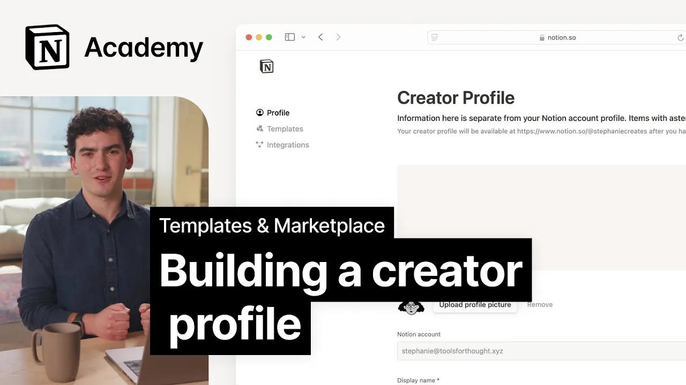

# Building a creator profile on Notion's Marketplace

**URL:** [https://www.youtube.com/watch?v=TEI7JaibMOQ](https://www.youtube.com/watch?v=TEI7JaibMOQ)
**Date:** 2024-10-28

## Transcript

**[Voiceover]**

"[Music] in this lesson you'll learn how to build out a Creator profile page that reflects your brand and supports your business your creator profile is not only a prerequisite for listing a template it's an opportunity to share your brand with the World creator profiles can be featured in The Marketplace and they're an easy place to send your followers"

"to explore all of the templates that you have to offer if you're building a brand from scratch it's important to think through how that identity will show up across multiple platforms since you'll likely want to Market your templates out outside of just the marketplace this is an opportunity to zoom out of the first template you're creating and think"

"about the value and Vibes you are bringing not only to the marketplace but to the entire world I think with all good businesses that come from a passion it's because they're a passion that you're able to keep doing them and you're able to keep what you're creating authentic quite quickly you start to build a dialogue with a community"

"I was solving my problems and then sharing it it then became about what does my community and what do the people around need to make their lives simpler so as a productivity and kind of tech YouTube Creator the notion template thing has actually been the part of the business that's allowed me to sustain the whole thing because it"

"it is actually valuable and people are really happy to exchange a bit of money for something that will make their lives easier we see a lot of template creators with notion style black and white branding and they can start to blend together and don't feel differentiated even as a oce template Creator you should strive for a distinct digital"

"identity with that in mind let's break down the components of a highly successful Creator profile the matcha Vibe we love this profile because it has a strong visual brand conveys a very clear value proposition and targets a specific set of people personal users interested in aesthetically pleasing and functional notion templates to support their day-to-day lives how do we"

"get all of that from just looking at this let's break it down first we have the header image and profile photo this is your first opportunity to give an impression of you these visual assets can help people understand your overall Vibe and give you an opportunity to draw attention to one or two things in this case matcha and"

"Vibes next is the creator profile name and handle generally we say to try to match other social handles if you have them it's important to note that it's against our brand guidelines to use the word notion or template in your profile name or handle again this is a great opportunity to build your own unique brand then we have"

"the bio good bios are short friendly and name the Creator's qualifications in this case it's just a single sentence we love that it's easy to digest and how this Creator Tastefully uses emojis to help reinforce their aesthetic next we have categories and links categories will be automatically generated based on your templates while adding links to socials gives you"

"additional credability and also provides a way for people to find you outside of the marketplace lastly the templates themselves your templates will be listed in your profile and you can also choose to pin the ones you want your audience to come across First Once you have the assets in place building your creator profile is relatively straightfor all you"

"need to do is head over to notion.so profile and click the create a profile button from from there you'll be prompted to fill out all of the fields in this form populate these according to the best practices and optionally choose whether you'd like people to email you directly from your creator profile once you're done just hit save before"

"we move on let's look at a few more exceptional profiles to better understand how you might showcase your brand on the marketplace starting with Grace this is a great example of a Creator who is notion first and has built a whole brand around building her digital products in notion there's a clear brand clearly marked value propositions and a"

"short but informative bio here's another one how to ADHD Jessica clearly recognizes the value she brings to the digital world and she owns it everything from her name and handle to her bio set her up as someone who can better support people looking to work better with their brains on top of that there's a clear visual identity that"

"even carries through to our templates creating a cohesive and recognizable style that users can connect with lastly let's check out Cajun koi Academy this is another example of bringing an established brand into the notion ecosystem once again we see a dis and recognizable visual identity with the cloud logo and vibrant color scheme the profile effectively communicates Cajun Koy"

"Academy's qualifications as doctors turned YouTubers and sets the right expectations for potential template users what's more by leveraging their existing brand recognition they're more likely to attract followers from other platforms and gain new ones with those in the notion Community as you build your own Creator profile remember to Showcase your unique personality and expertise while keeping your content"

"focused and userfriendly to attract and engage potential templ users look through the marketplace to browse more profiles and get inspired we can't wait to see what you create [Music]"

